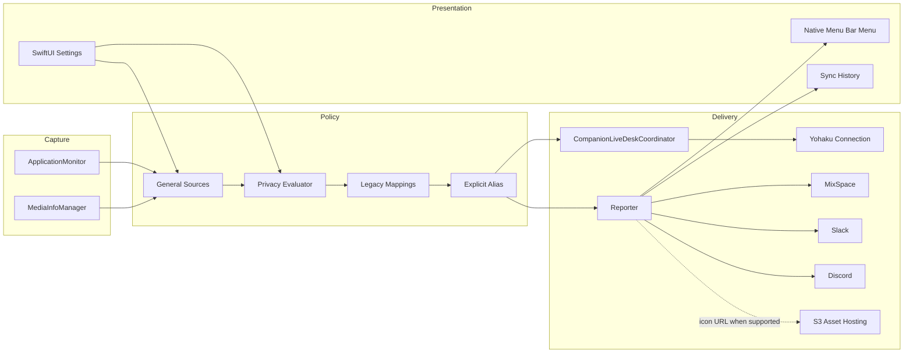
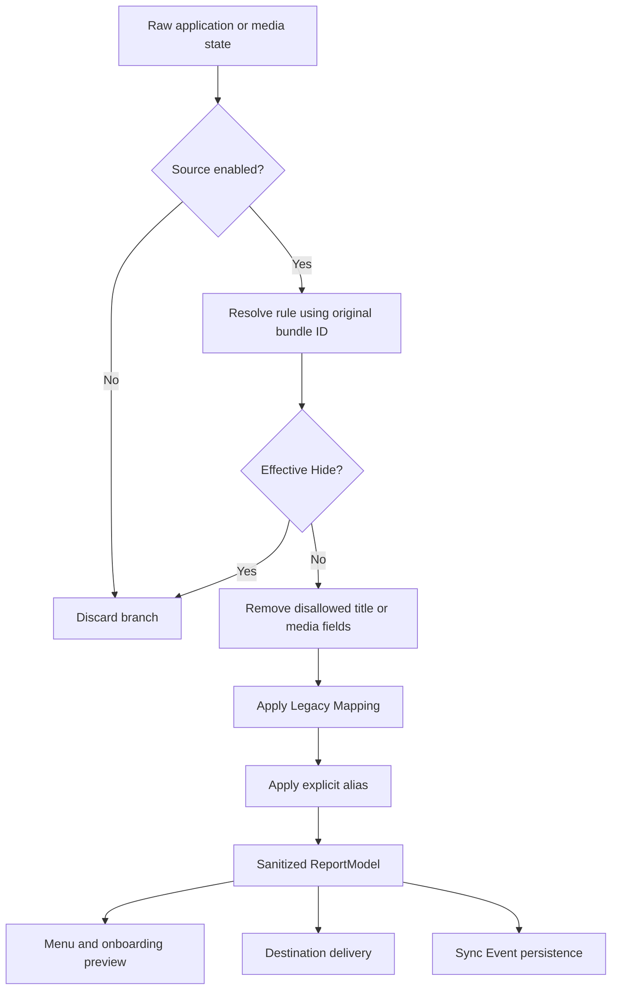
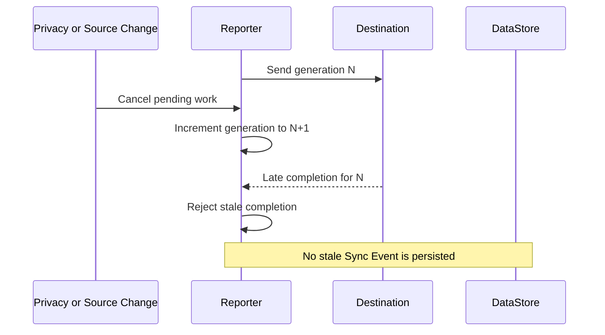
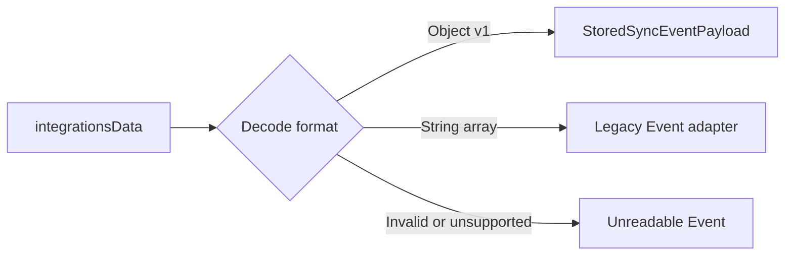
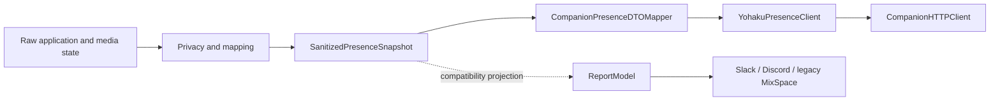

# Yohaku Companion Architecture

## Scope and Invariants

Yohaku Companion is an independently installed macOS menu bar companion for Yohaku. The architecture enforces five product invariants:

1. Only a sanitized current Presence may reach UI preview, destinations, or history.
2. Pairing never enables Live Desk; public sharing requires an explicit post-preview consent action.
3. Yohaku is the first-party connection; Slack, Discord, and legacy MixSpace are optional Bridges, while S3 is asset infrastructure.
4. A stale delivery generation must not persist after privacy, source, connection, pause, or sleep changes.
5. Local history is a bounded delivery audit, not a productivity-analysis dataset.

## Product Identity Boundary

The Xcode project, target, scheme, module, and source directory use `YohakuCompanion`. Legacy protocol and compatibility type identifiers remain implementation details and are not the application identity.

| Runtime boundary | Yohaku Companion identity |
| --- | --- |
| Release bundle | `dev.innei.YohakuCompanion` |
| Debug bundle | `dev.innei.YohakuCompanion.debug` |
| Application Support and SwiftData | Directory derived from the active Yohaku Companion bundle identifier |
| Keychain and protected journal | Service and directory derived from the active Yohaku Companion bundle identifier |
| App version | `1.7.3`, retained for the Core minimum-client contract |

The application does not inspect, copy, or migrate ProcessReporter preferences, Application Support, history, caches, or Keychain credentials. Both applications may coexist. Yohaku Companion is registered as a new device and must be paired again with a new one-time code.

## Runtime Architecture



## User Interface Ownership

| Module | Responsibility |
| --- | --- |
| `Features/MenuBar` | Daily Presence status, current sanitized preview, destination results, asset result |
| `Features/Onboarding` | First-run welcome, source/privacy choices, and entry into Yohaku pairing |
| `Features/Settings/Yohaku` | Pairing, sanitized preview, explicit Live Desk consent, pause, and device removal |
| `Features/Settings/General` | Sharing state, sources, capabilities, startup |
| `Features/Settings/Destinations` | MixSpace, Slack, Discord, and Application Icon Hosting configuration |
| `Features/Settings/PrivacyRules` | Global defaults and application-centered rules |
| `Features/Settings/History` | Native Sync Event list, filters, and Inspector |
| `Features/Settings/Advanced` | Engine controls, compatibility, storage, backup, diagnostics, and destructive maintenance |

The Settings shell is SwiftUI hosted by `SettingWindow`. Destination configuration uses native SwiftUI drafts with explicit test, save, credential intent, and dirty-navigation protection. Only the raw Legacy Mapping editor and cached-icon table remain AppKit compatibility surfaces; legacy Filter, History, and integration forms are not runtime routes.

## Capture and Privacy Pipeline



`ReportModel.sourceProcessApplicationIdentifier` and `sourceMediaApplicationIdentifier` are transient. They preserve original identity for policy lookup and UI deep links when a Legacy Mapping rewrites the provider-facing identifier.

Legacy `filteredProcesses` and `filteredMediaProcesses` remain fail-closed projections. `PresencePrivacyRulesRepository` merges them into effective rules and uses ordered writes so a newly added Hide cannot briefly expose data.

`ApplicationMonitor` reads foreground application identity when the Applications source is enabled. It reads the active window title only while **Window Titles** is enabled; Accessibility permission alone does not activate title collection. Application identity remains available without Accessibility permission.

## Reporter Lifecycle and Cancellation

`Reporter` is main-actor isolated because capture callbacks, AppKit state, extension registration, and `ReportModel` are not child-task-safe. Destinations are executed sequentially from a registry snapshot. Asset-independent destinations are ordered before destinations that may request a public icon.

Preparation and delivery each have a generation counter:



The generation is checked before and after asset resolution, each destination await, and persistence. `DataStore.saveReport` also checks task cancellation before insertion and before save. If a generation becomes stale immediately after save, its UUID is durably quarantined from History before physical deletion. Failed deletion remains suppressed and is retried on the next launch.

Slack has a serialized delivery queue. Reporting operations can be cancelled without cancelling a required remote clear operation, and Alamofire requests receive task cancellation. Remote clears use bounded retries, retry again after network recovery, and are awaited within the application termination deadline. Discord clears again after a cancelled late SDK completion so an obsolete activity cannot reappear.

When the network is unavailable, Reporter publishes only the sanitized local presentation and records a single “fresh capture required” marker. It does not enqueue or retain a report for replay. Recovery captures current application and media state and executes the complete generation and privacy pipeline again.

Sleep stops monitoring sources, timers, preparation, and delivery. Wake recreates current sources from preferences after the application-level wake delay.

## Destination and Asset Results

Live presentation uses `PresenceDestinationDeliveryResult` and a separate `PresenceAssetResolution`. Aggregate status combines:

- Onboarding and sharing state.
- Network waiting as an internal runtime reason and native menu status item; the visible aggregate remains Degraded or Error according to delivery impact.
- Per-destination sending, success, failure, and skipped state.
- Independent asset degradation.

S3 is represented by `S3AssetHostingService`. It resolves a cached public URL or performs an on-demand upload only when a registered destination or an explicitly enabled Live Desk session can consume a public application-icon URL. Live Desk receives only a URL whose HTTPS host matches the active asset-hosting configuration; the local application identifier and PNG candidate never enter the sanitized snapshot. Failed uploads add only the local application identifier and privacy-sanitized display name to a durable retry queue; credentials and icon data are never persisted there. Maintenance can retry that queue or rebuild current cache records from installed application icons. Discord does not depend on S3 because it uses Discord asset keys.

## Sync Event Persistence

`Database` and `DataStore` are actors and are the only SwiftData boundary. The schema remains:

- `ReportModel` for sanitized Presence scalars and history metadata.
- `IconModel` for cached public application icon URLs.

Modern audit metadata uses a versioned Codable envelope stored in the existing `ReportModel.integrationsData` field:



This avoids a SwiftData schema migration while preserving legacy-format rows created inside Yohaku Companion’s own data store. It does not import rows from ProcessReporter. Modern payloads contain only:

- Trigger reason.
- Normalized per-destination state, timestamps, and fixed error code/message.
- A safe output summary derived from the final provider render only when delivery succeeds.
- Asset state and fallback usage without the public URL.

They do not contain raw capture objects, bundle identifiers, credentials, endpoints, request bodies, authorization headers, response bodies, icons, or artwork.

Legacy integration arrays are adapted lazily. Recorded destinations are `Succeeded`; unrecorded current destinations are `Unknown`. A legacy `S3` entry becomes `Legacy Asset Result`. History is capped at 5,000 rows with oldest-first deletion.

## Yohaku Companion Protocol Boundary

The first-party Yohaku connection does not reuse provider dictionaries or serialize `ReportModel`. Its boundary is:



The mapper owns finite-number checks, seconds-to-millisecond conversion, explicit nullable encoding, field limits, activity-key validation, and HTTPS asset-host allowlisting. The transport owns payload size, endpoint safety, and Authorization header construction. The ordered writer reserves sequence durably before sending and uses a serialized send slot so heartbeat, media, and lifecycle operations cannot race.

An ambiguous transport failure is retried once with the same encoded logical request. A repeated request therefore retains its sequence and request ID; a new sequence is never allocated merely because the first HTTP response was lost.

`CompanionConnectionStore` persists only validated instance, device, sequence, and opt-in metadata in UserDefaults. The Device Token uses Yohaku Companion’s bundle-scoped `CredentialStore` transaction boundary, and pairing always commits `isLiveDeskEnabled = false`. It never queries the ProcessReporter credential namespace. `CompanionPairingClient` preflights both that protected authority and the server capability contract before consuming a one-time code, then passes the minted Token directly into the store; the token is not resolved again until explicit local opt-in is true.

`CompanionLiveDeskCoordinator` is independent of `Reporter`: it negotiates capabilities before creating a writer, captures fresh application and media values after the privacy policy, coalesces activation, media-semantic, and heartbeat requests, rate-limits against negotiated limits, rebuilds a fresh snapshot after network recovery, and clears best-effort on sleep, screen lock, and termination. Media collection is installed only when both the local source and negotiated `mediaTimeline` capability are enabled. `MediaInfoManager` keeps the legacy Reporter callback and Companion's payload-free semantic observer as independent owners of one underlying provider session. `CompanionPresenceAuthorityRegistry` preserves one serialized writer and sequencer for the same paired server/device across lifecycle renegotiation; duplicate sleep/lock notifications are idempotent, and wake explicitly awaits the bounded cleanup task before restarting capability negotiation. Local opt-in and the server `liveDesk` capability remain fail-closed. Legacy MixSpace delivery therefore remains active without receiving or influencing Companion state.

Schema or feature rejection is not treated as a generic transport degradation. `COMPANION_SCHEMA_UNSUPPORTED`, `COMPANION_FEATURE_UNAVAILABLE`, and an undecodable HTTP 426 terminate the current authority and heartbeat, then re-enter capability negotiation before any further mutation.

## Local Compatibility and Migration

Product identity migration from ProcessReporter is explicitly unsupported. Yohaku Companion treats a missing bundle-scoped preference store as a new installation, applies safe defaults, and requires a new Yohaku pairing. No startup path scans another bundle’s UserDefaults, Application Support, database, or Keychain service.

`PresencePreferencesMigrator` uses ordered version steps:

| Version | Migration |
| --- | --- |
| 1 | Distinguish new and existing installations; preserve prior window-title behavior and mark upgrades as onboarded |
| 2 | Create application-centered privacy configuration and merge legacy filters |

These steps apply only to data already owned by the Yohaku Companion bundle namespace. Version steps are independent. A version-1 user who later disables Window Titles is not passed through version 1 again during the version-2 migration.

Settings export excludes credentials and retains legacy Filter and Mapping fields for compatibility. Import first validates a complete staged snapshot without mutation. Historical exports containing plaintext credentials then require an explicit restore, omit, or cancel decision. A restore aggregates MixSpace, Slack, and S3 changes into one `CredentialStore` transaction with redacted pending integration preferences; relays are published only after that transaction is durable. Import then pauses reporting, applies the remaining snapshot, reconciles legacy filters, and restores the requested sharing state only if a valid destination and credential authority are available. Truncated integration dictionaries are rejected atomically; legacy backups rebuild application rules from their complete filter snapshot.

## Credential Authority

Destination secrets use `CredentialStore`, backed by Keychain for stable signed builds and a protected local journal when Keychain identity is unavailable. The service and journal directory are derived from the active Yohaku Companion bundle identifier, preventing accidental access to ProcessReporter credentials. Preference values are redacted. Multi-field changes are coordinated through `SettingsMutationCoordinator` and the credential journal so partial UI updates cannot become the authority. Reset and erase run as exclusive maintenance transactions that close mutation admission until completion.

If the protected journal is unreadable, reporting fails closed. Recovery preserves the unreadable store before any re-entry workflow.

## Advanced Maintenance

`Reset Settings` restores default preference relays while preserving Sync History, icon cache, failed-upload queue, and protected credential values. `Erase All App Data` uses a separate two-confirmation path, pauses sharing and clears runtime secrets before its first suspension, then independently removes Yohaku Companion credentials, Sync History, icon cache, failed-upload queue, and upload fingerprints before restarting onboarding. Runtime state remains fail-closed even when one removal fails. An inaccessible same-product legacy Keychain entry is reported rather than falsely claimed as removed; ProcessReporter Keychain services remain out of scope.

Diagnostics are deliberately sanitized. They include version, capability state, counts, destination count, and the latest fixed-code runtime error; they exclude Presence content, endpoints, credentials, and provider responses.

## Verification Boundaries

The primary verification commands are:

```bash
xcodebuild -project YohakuCompanion.xcodeproj -scheme YohakuCompanion \
  -configuration Debug -destination 'platform=macOS,arch=arm64' \
  CODE_SIGNING_ALLOWED=NO SWIFT_STRICT_CONCURRENCY=complete build

xcodebuild -project YohakuCompanion.xcodeproj -scheme YohakuCompanion \
  -configuration Debug -destination 'platform=macOS,arch=arm64' \
  CODE_SIGNING_ALLOWED=NO SWIFT_STRICT_CONCURRENCY=complete analyze
```

Runtime smoke tests use the Debug bundle identifier and a temporary user directory. They must not mutate the release Yohaku Companion installation or ProcessReporter preferences, Application Support, Keychain authority, or database.
