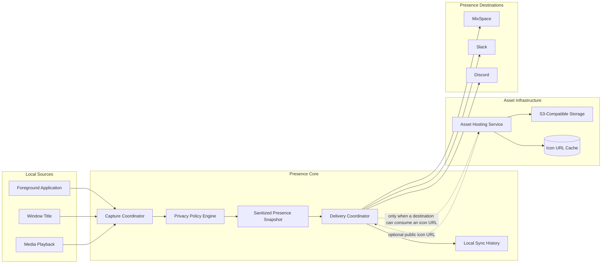
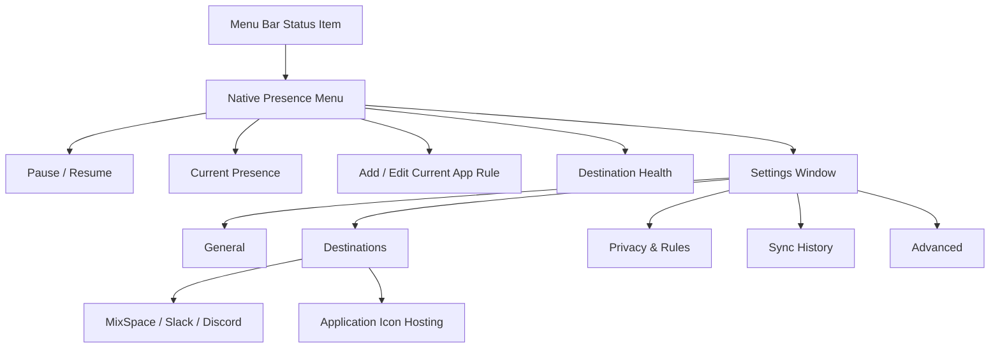
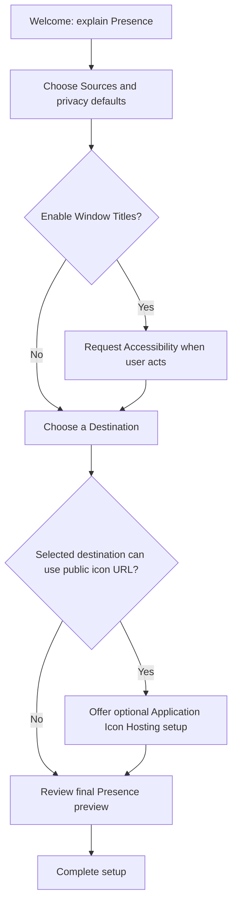

# Yohaku Companion Presence 产品与 UI 改造规范

| 字段 | 内容 |
| --- | --- |
| 文档状态 | Approved for implementation |
| 版本 | 1.1 |
| 日期 | 2026-07-16 |
| 产品形态 | Apple Silicon (`arm64`) 上的 macOS 15+ 菜单栏应用 |
| 主要入口 | 原生 Menu Bar `NSMenu` |
| 次要入口 | Settings Window |
| 实现边界 | AppKit 管理应用生命周期、`NSStatusItem`、`NSMenu` 与 `NSWindow`；SwiftUI 承载 Settings 内容 |

## 1. 文档目的

本规范定义 Yohaku Companion 作为“个人 Presence／状态同步工具”的完整产品边界、信息架构、交互模型、视觉系统、领域模型、迁移策略和验收条件。

本规范是后续产品、设计和工程实现的共同依据。实现过程中不得重新将 S3 视为 Presence Destination，不得将 Sync History 重新设计为生产力分析，也不得以暴露内部配置结构代替面向用户的任务界面。

## 2. 核心产品决策

| 决策 | 结论 |
| --- | --- |
| 产品定位 | 面向单个用户的个人 Presence／状态同步工具 |
| 核心任务 | 采集用户当前应用、窗口和媒体状态，经隐私规则处理后同步至外部目的地 |
| 主入口 | 原生菜单栏菜单，用于查看当前状态、暂停／恢复共享、添加当前应用规则和检查目的地健康度 |
| Settings 定位 | 低频配置、隐私规则、目的地管理、同步审计和诊断 |
| S3 定位 | Application Icon Hosting；提供可公开访问的应用图标 URL，不是 Presence Destination |
| History 定位 | 本地同步审计记录，不是活动统计或生产力分析 |
| UI 技术方向 | 使用原生 AppKit 菜单承载高频状态与命令，SwiftUI 承载 Settings 内容 |
| 视觉方向 | Native Presence Utility：原生、克制、紧凑、状态优先 |

## 3. 产品定义

### 3.1 目标用户

- 希望把当前使用的应用、窗口上下文或正在播放的媒体同步到个人服务的 macOS 用户。
- 能够配置 MixSpace、Slack、Discord 或 S3-compatible storage，但不应被内部扩展、数据库和映射类型所干扰。
- 对隐私边界敏感，需要随时知道“当前共享了什么、共享到哪里、是否成功”。

### 3.2 核心用户任务

1. 从菜单栏确认 Presence 当前是否正在共享。
2. 查看当前即将或已经共享的应用、窗口和媒体内容。
3. 快速暂停或恢复全部 Presence 共享。
4. 确认各目的地是否连接并成功接收状态。
5. 配置目的地和应用图标托管。
6. 为特定应用隐藏、允许或重命名 Presence 内容。
7. 在发生异常时理解原因并完成修复。
8. 查看本地同步审计记录。

### 3.3 非目标

- 不提供工作时长、应用使用时长、专注度、效率评分或生产力趋势。
- 不构建团队 Presence 管理、成员监控或组织级控制台。
- 不提供通用 S3 文件浏览器、对象管理器或图片托管后台。
- 不提供云端账号体系、跨设备配置同步或远程控制。
- 不把内部 Reporter Extension 机制直接暴露为面向用户的 Provider 概念。
- 本阶段仅保留 `ProcessReporter` 工程、target、scheme 与源码目录等内部技术名称，不将产品改名与 Swift 语言版本升级绑定。

## 4. 领域术语

| 术语 | 定义 | 示例 |
| --- | --- | --- |
| Source | 在本机采集 Presence 原始信息的来源 | Foreground Application、Window Title、Media |
| Raw Snapshot | 尚未经过隐私规则处理的内存态采集结果 | 原始 bundle ID、窗口标题、媒体标题 |
| Privacy Policy | 决定哪些字段可被共享，以及是否进行重命名 | 隐藏 1Password 窗口标题 |
| Presence Snapshot | 经过隐私规则处理、允许投递和持久化的状态 | `Xcode · Editing Project` |
| Destination | 接收 Presence Snapshot 的外部服务 | MixSpace、Slack、Discord |
| Asset Hosting | 将应用图标转换为公共 URL 的基础设施 | S3-compatible storage |
| Delivery Result | 单个 Destination 对一次 Presence 投递的结果 | succeeded、failed、skipped |
| Asset Result | 一次图标解析、缓存或上传的结果 | cached、uploaded、degraded |
| Sync Event | 本地保存的一次经过隐私处理的快照及其投递结果 | History 中的一行 |

## 5. 目标系统架构



### 5.1 强制架构边界

- `S3AssetHostingService` 不得实现 `PresenceDestination`。
- Asset Hosting 由目的地能力按需触发；没有启用需要公共图标 URL 的目的地时，不应上传图标。
- Asset Hosting 失败不得默认阻止 Presence 文本投递。目的地能够接受无图标状态时，应继续投递并将结果标记为 degraded。
- Raw Snapshot 只允许存在于内存中，不得写入 History、日志或诊断导出。
- History 仅持久化经过 Privacy Policy 处理后的 Presence Snapshot。
- 每个 Destination 必须产生独立 Delivery Result；不得再用单一 `[String]` 成功名称列表代表完整投递状态。

## 6. 产品状态模型

### 6.1 全局状态

| 状态 | 触发条件 | 菜单栏语义 | 菜单状态文案 |
| --- | --- | --- | --- |
| Setup Required | 尚无可用目的地，或 onboarding 未完成 | 中性、未配置 | `Finish Setup` |
| Paused | 用户关闭 `Bridge Sharing` | 中性暂停 | `Bridge delivery is paused` |
| Ready | 正在监控，当前无投递任务且没有未解决异常 | 标准图标 | `Sharing is active` 或 `Nothing to share` |
| Syncing | 正在准备或投递 Presence | 轻量进度状态 | `Syncing presence…` |
| Degraded | 至少一个目的地成功，但另一个目的地或 Asset Hosting 失败 | 感叹号标记 | `Shared with some issues` |
| Error | 所有启用目的地失败、持久化失败，或凭据安全边界不可用 | 错误标记 | `Presence could not be shared` |

状态聚合优先级：安全或持久化错误 > 用户暂停 > 正在同步 > 全部失败 > 部分失败 > 正常。

网络离线不是独立的视觉状态。它根据实际影响聚合为 Degraded 或 Error，并在菜单中显示 `Waiting for network`。

没有 Ready Destination 时，`Bridge Sharing` 必须显示为关闭且不可启用，并提供 `Set Up a Destination…`。禁用最后一个 Ready Destination 时，界面应在保存前明确提示“Bridge delivery will stop”，确认后同时关闭 Bridge Sharing，避免出现开关已开启但没有任何实际接收方的伪运行状态。

### 6.2 配置状态与运行状态分离

每个 Destination 同时具有以下两组状态：

| 类型 | 枚举 |
| --- | --- |
| Configuration State | Not Configured、Disabled、Ready、Invalid |
| Delivery State | Never Sent、Sending、Succeeded、Failed、Skipped |

设置页面优先展示 Configuration State；菜单优先展示最近一次 Delivery State。不得用一次网络失败把配置标记为 Invalid。

### 6.3 Asset Hosting 状态

| 状态 | 含义 |
| --- | --- |
| Not Configured | 未配置 S3-compatible storage |
| Disabled | 已保存配置但未启用图标托管 |
| Ready | 配置有效，可按需解析或上传图标 |
| Uploading | 正在上传当前应用图标 |
| Degraded | 上传或公共 URL 校验失败；Presence 可能仍已成功同步 |

## 7. 整体信息架构



## 8. Menu Bar 规范

### 8.1 Status Item

- 使用从 App Icon 中央“窗口／状态卡片”图形抽取的单色 Template Image。
- 不再使用 `icloud.*` 系统图标表达产品身份。
- 图标必须适配浅色、深色和高对比度菜单栏。
- 状态差异由轮廓、暂停、同步或感叹号标记表达，不依赖颜色。
- Accessibility Description 必须包含当前状态，例如 `Yohaku Companion, sharing active`。

### 8.2 打开行为

| 操作 | 结果 |
| --- | --- |
| 单击菜单栏图标 | 打开原生 Presence Menu |
| 单击菜单外部 | 关闭菜单 |
| `Esc` | 关闭菜单 |
| 右键单击 | 使用与主入口一致的原生菜单语义 |
| `⌘,` | 打开 Settings Window |

### 8.3 Menu 结构约束

- 使用系统 `NSMenu` 布局、选中态、键盘导航和 VoiceOver 语义。
- 不使用自定义 `NSMenuItem.view` 重建卡片、双列状态表或滚动容器。
- Current Presence 标题应限制长度，避免窗口标题或媒体标题使菜单异常扩宽。
- 当前应用、窗口和媒体是只读信息项；可执行操作必须使用独立菜单命令。

### 8.4 Menu 结构

```text
✓ Bridge Sharing
  Sharing is active

CURRENT PRESENCE
  [App Icon] Xcode — Editing Project
  [Artwork]  Playing: Song — Artist
  Add Rule for Xcode…

DESTINATIONS
  [MixSpace] MixSpace — Synced
  [Slack]    Slack — Synced
  [Discord]  Discord — Failed

Settings…                         ⌘,
Check for Updates…
Quit Yohaku Companion             ⌘Q
```

### 8.5 Sharing 状态

- 主控件名称固定为 `Bridge Sharing`，不使用 `Enabled` 或 `Reporting Allowed`。
- 使用原生勾选菜单项表达开关状态，并即时生效。
- 关闭后立即取消待发送任务并停止不必要的监控；不得继续更新或显示“当前正在共享”的内容。
- Paused 状态保持 `Bridge Sharing` 为未勾选状态，并显示只读状态说明。
- 凭据安全边界不可用时，该菜单项强制关闭且不可启用，并显示可执行的修复命令。

### 8.6 Current Presence

展示经过 Privacy Policy 处理后的内容，不展示 Raw Snapshot。

显示优先级：

1. 应用图标、应用显示名称。
2. 允许共享时显示窗口标题或映射后的描述。
3. 媒体正在播放时显示 artwork、标题与 artist。
4. 没有可共享内容时显示 `Nothing to share right now`。

Current Presence 不是编辑器，其应用和媒体项目均不可点击。菜单必须提供独立、对象明确的 `Add Rule for <Application>…` 或 `Edit Rule for <Application>…` 命令；媒体项目不得隐式操作前台应用的规则。

### 8.7 Destinations

- 仅展示已配置的 MixSpace、Slack 和 Discord。
- 每行包含 Provider 图标、名称和最近状态。
- 全局同步期间只显示一次 `Syncing presence…`，不得在每个 Ready Destination 上重复相同的 Syncing 文案。
- 单击目的地项目打开 Settings 对应详情；失败消息可通过项目说明提供。
- 尚无目的地时显示空状态与主操作 `Set Up a Destination…`。
- S3 不出现在 Destinations 列表中。
- 只有图标托管异常影响当前投递时，才显示 `Review Application Icon Hosting…` 恢复命令。

### 8.8 应用命令

- 菜单尾部固定提供 `Settings…`、`Check for Updates…` 和 `Quit Yohaku Companion`。
- `Settings…` 保留 `⌘,`，`Quit Yohaku Companion` 保留 `⌘Q`。
- 这些命令使用原生菜单项，不使用自定义 Footer View。

## 9. Settings Window 规范

### 9.1 Window Shell

| 属性 | 规范 |
| --- | --- |
| 默认尺寸 | 860 × 620 pt |
| 最小尺寸 | 720 × 500 pt |
| Resize | 允许 |
| Window Frame | 关闭和重新打开后恢复；屏幕变化后保证标题栏仍在可见区域 |
| 导航 | SwiftUI `NavigationSplitView` 风格的固定侧边栏 |
| 侧边栏宽度 | 190–210 pt |
| 内容宽度 | 表单最大可读宽度约 620 pt，宽窗口不无限拉伸字段 |
| 生命周期 | 关闭 Settings 不退出应用；应用恢复 accessory activation policy |
| 恢复 | 记住最后访问页面；通过菜单深链时覆盖最后页面 |

设置窗口由 AppKit `NSWindow` 管理，由一个 SwiftUI Root View 作为内容。不得将 UI 重建设计成同时重写应用生命周期、偏好持久化或 Reporter 并发模型的前置条件。

### 9.2 侧边栏

| 页面 | Symbol 建议 | 目的 |
| --- | --- | --- |
| General | `gearshape` | 全局共享、Sources、权限、启动行为 |
| Destinations | `dot.radiowaves.left.and.right` | Presence Destinations 与图标托管 |
| Privacy & Rules | `hand.raised` | 全局隐私默认值和应用规则 |
| Sync History | `clock.arrow.circlepath` | 本地投递审计 |
| Advanced | `slider.horizontal.3` | 引擎、存储、备份、更新和诊断 |

旧的 `Filter` 与 `Mapping` 不再作为一级导航项。

## 10. General 页面

### 10.1 页面结构

1. Presence Sharing
2. Sources
3. Permissions & Components
4. Startup

### 10.2 Presence Sharing

- 标题：`Presence Sharing`。
- 主 Toggle：`Bridge Sharing`。
- 摘要显示启用目的地数量和最近同步状态。
- 没有配置目的地时，Toggle 不应伪装成可正常工作；显示 `Set Up a Destination…`。
- 全局共享开关即时保存并即时生效。

### 10.3 Sources

| Source | 用户文案 | 默认值（新安装） | 说明 |
| --- | --- | --- | --- |
| Application | `Applications` | On | 共享前台应用名称 |
| Window | `Window Titles` | Off | 需要 Accessibility；隐私敏感，必须明确启用 |
| Media | `Media Playback` | On | 共享当前播放媒体 |

- Sources 为“允许采集的类别”，不等同于目的地内容模板。
- 关闭 Application 后仍可只共享 Media。
- 关闭 Media 后应停止对应监听和辅助进程。
- 所有 Sources 关闭时，全局共享保持用户选择，但状态显示 `Nothing to share`，并提供说明。
- `Window Titles = Off` 仅是全新安装默认值。升级安装必须从旧行为迁移为 On，以避免升级后静默改变既有 Presence 内容；迁移完成后用户可主动关闭。

### 10.4 Permissions & Components

| 能力 | 状态 | 操作 |
| --- | --- | --- |
| Accessibility | Not Requested / Granted / Denied | `Open System Settings…` |
| Media Provider | Ready / Helper Required / Failed | `Install Helper…` 或 `Repair…` |
| Credential Storage | Ready / Recovery Required | 仅在异常时显示修复入口 |

- Accessibility 仅影响窗口标题，不影响应用身份识别。
- 权限不是 onboarding 的阻塞条件；用户可以在没有窗口标题权限时继续使用应用 Presence。
- 权限状态必须在窗口重新获得焦点时刷新。

### 10.5 Startup

- Toggle：`Launch at Login`。
- 使用系统 Service Management 状态作为事实来源。
- 注册失败时回滚 UI，并显示持久 Inline Notice。

## 11. Destinations 页面

### 11.1 首页分组

#### Presence Destinations

- MixSpace
- Slack
- Discord

#### Resources

- Application Icon Hosting
  - 副标题：`S3-compatible storage`

每行包括图标、名称、配置状态、最近运行状态和 disclosure indicator。不得把 S3 放入 Presence Destinations。

### 11.2 Destination 详情页通用结构

1. Provider Header：图标、名称、状态、Enable Toggle。
2. Required Configuration：必要凭据和地址。
3. Content：此目的地将使用哪些 Presence 字段。
4. Preview：基于当前 sanitized Presence 的输出预览。
5. Advanced：低频或 Provider-specific 选项。
6. Footer：`Test`、`Save`、保存状态和验证错误。

### 11.3 通用保存行为

- Enable Toggle 只有在已保存配置有效时才能打开。
- Credential 和端点编辑使用草稿状态，不即时写入持久化。
- `Test` 使用当前草稿值，不隐式保存。
- `Save` 通过现有事务式偏好与 Keychain 边界统一提交。
- 离开存在未保存内容的详情页时，显示 `Save`、`Discard Changes`、`Cancel`。
- 已保存 Credential 不回显明文；界面只显示 masked placeholder，并提供 Replace／Remove。

### 11.4 MixSpace

| 分组 | 字段 |
| --- | --- |
| Required | Endpoint、API Token |
| Content | Application、Window Title、Media、Application Icon |
| Advanced | HTTP Method；默认 POST |
| Test | 对端点和凭据进行验证，不写入正式 Presence History |

- Application Icon 为可选增强内容。
- Asset Hosting 不可用时仍发送 Presence，并在结果中标记 asset degraded。

### 11.5 Slack

| 分组 | 字段 |
| --- | --- |
| Required | API Token |
| Content | Status Text Template、Default Status、Default Emoji |
| Timing | Expiration |
| Advanced | Conditional Emoji Rules |
| Test | 发布测试状态，并明确说明会修改当前 Slack 状态 |

- Template 可用变量通过 token picker 插入，不要求用户记忆内部变量名。
- Conditional Emoji Rules 使用应用和媒体对象选择器；原始表达式仅在 Advanced Diagnostics 中可见。

### 11.6 Discord

| 分组 | 字段 |
| --- | --- |
| Required | Application ID |
| Content | Show Application、Show Media、Prioritize Media、Listening Activity、Timestamps |
| Assets | Large Image Key/Text、Brand Small Image Key |
| Advanced | Optional Button Label/URL |
| Test | 发布本地测试 Rich Presence |

- Discord 使用预上传 Asset Key，不与 S3 Application Icon Hosting 建立错误依赖。

### 11.7 Application Icon Hosting

页面标题固定为 `Application Icon Hosting`，副标题为 `S3-compatible storage`。

| 分组 | 字段或内容 |
| --- | --- |
| Status | Not Configured / Disabled / Ready / Uploading / Degraded |
| Storage | Bucket、Region、Endpoint |
| Credentials | Access Key、Secret Key |
| Public Access | Object Path、Custom Domain |
| Validation | 预览最终公共 URL 形式，检查 HTTPS 与公开可访问性 |
| Maintenance | Cached Icon Count、Retry Failed Uploads、Rebuild Cache、Clear Cache |

行为要求：

- `Test Upload` 是显式外部写操作；执行前说明会上传测试对象。
- 测试应验证上传和公共读取，清理测试对象采用 best effort，并明确报告结果。
- 缓存图标列表放入 `Manage Cached Icons…` sheet，不在主页面展示数据库表格。
- 删除缓存只删除本地 URL 记录；如果无法安全确认远端对象所有权，不自动删除 S3 对象。
- `Show Database` 不作为主操作。数据库位置仅出现在 Advanced > Diagnostics。

## 12. Privacy & Rules 页面

### 12.1 设计原则

隐私设置以“应用”为中心，而不是以内部 filter 数组和 mapping type 为中心。用户首先选择应用，再决定该应用的 Presence 行为。

### 12.2 Global Defaults

| 内容 | 控件 | 新安装默认值 |
| --- | --- | --- |
| Application Name | Share / Hide | Share |
| Window Title | Share / Hide | Hide |
| Media | Share / Hide | Share |

### 12.3 Application Rules 列表

每行显示：

- 应用图标与显示名称。
- bundle identifier 作为次级信息。
- 当前覆盖摘要，例如 `Window hidden · Alias: Coding`。
- 是否存在 Legacy Advanced Mapping。

支持搜索、按最近观察应用添加规则、从已安装应用选择以及删除规则。

### 12.4 Rule Editor

| 字段 | 可选值 |
| --- | --- |
| Application Presence | Use Global Default / Share / Hide |
| Window Title | Use Global Default / Share / Hide |
| Media Presence | Use Global Default / Share / Hide |
| Display Alias | Optional string |

- Rule Editor 使用 sheet，采用显式 `Cancel` 和 `Save Rule`。
- Preview 必须显示规则应用后的最终 Presence，而不是原始内容。
- `Hide` 的优先级高于 Alias。
- 空 Alias 表示使用原始应用显示名称。

### 12.5 Legacy Advanced Mappings

当前四类原始 Mapping 保留兼容，但移动到 `Advanced > Legacy Mappings`：

- Process Application Identifier
- Process Name
- Media Process Application Identifier
- Media Process Name

新建普通隐私规则不再生成 bundle identifier 重映射。既有映射继续执行，并在相关 Application Rule 上显示 `Legacy Mapping Applied`。未来移除这些映射必须另行制定数据迁移规范。

## 13. Sync History 页面

### 13.1 定位

Sync History 是“我向哪些目的地发送了什么，以及结果如何”的本地审计记录。不得增加时长统计、排行榜、图表或效率结论。

### 13.2 主从布局

- 左侧／主区域：按时间倒序的 Sync Event 列表。
- 右侧 Inspector：选中事件的 sanitized snapshot、asset result 和逐目的地结果。
- 窗口过窄时 Inspector 作为详情页或 sheet 展示。

### 13.3 Event Row

每行显示：

- 时间。
- 应用或媒体主摘要。
- 聚合结果：Succeeded、Partial、Failed、Skipped。
- 目的地图标组。

### 13.4 Inspector

| 区域 | 内容 |
| --- | --- |
| Presence | 应用、允许保存的窗口标题、媒体信息 |
| Destinations | 每个目的地的状态、耗时、经过清理的实际输出摘要、错误摘要 |
| Application Icon | Not Requested / Cached / Uploaded / Failed |
| Metadata | Event ID、时间戳、触发原因 |

- 不展示或保存 Raw Snapshot。
- Credential、Token、Authorization Header 和完整敏感响应体不得进入 History。
- 错误信息应为规范化错误码与安全摘要，不直接保存任意服务端响应。
- 实际输出摘要用于回答“该目的地当时显示了什么”，但只能由 sanitized Presence 渲染生成；不得保存完整 HTTP body、RPC payload 或 Provider response。

### 13.5 搜索与过滤

- 搜索应用名称、显示 Alias、媒体标题。
- 筛选 Destination。
- 筛选 Result：Succeeded、Partial、Failed、Skipped。
- 支持 `Copy Event as JSON`，导出内容与 Inspector 一致且不包含敏感字段。

### 13.6 保留与删除

- V1 继续保留最多 5,000 条记录，按最旧优先自动清理。
- `Clear Sync History…` 需要一次明确确认。
- `Erase All App Data…` 属于更高风险操作，放在 Advanced，并采用二次确认。

### 13.7 旧历史兼容

旧记录只有成功 integration 名称时：

- 显示为 `Legacy Event`。
- 已记录名称显示为 Succeeded。
- 未记录目的地显示为 Unknown，而不是 Failed。
- 如果旧记录包含 `S3`，在 Inspector 中迁移展示为 Legacy Asset Result，不把它显示为 Destination。

## 14. Advanced 页面

### 14.1 Reporting Engine

- Delivery Interval。
- Send when application focus changes。
- Ignore incomplete media metadata。
- 当前 Source provider 与运行状态。

这些是引擎调优项，不应出现在 General 的首要层级。

### 14.2 Legacy Mappings

- 查看、新建、编辑和删除现有原始 Mapping。
- 显示其可能绕过普通 Application Rules 直觉的说明。

### 14.3 Data & Storage

- Sync History 当前记录数。
- Icon Cache 当前记录数。
- `Clear Sync History…`。
- `Clear Icon Cache…`。
- `Reveal Application Data in Finder`。

### 14.4 Backup & Restore

- `Export Settings…`。
- `Import Settings…`。
- Export 不包含 Credential。
- 含明文 Credential 的旧版备份必须先显示 Restore／Without Credentials／Cancel 三选一确认，不得静默恢复或忽略。
- Restore 必须将全部 Credential 与对应 Endpoint／Bucket 作为单一受保护事务提交；失败时不得应用任何设置。
- Without Credentials 只可复用仍绑定于相同 authority 的本机受保护 Credential；否则禁用对应 Destination／Asset Hosting 并要求复核。
- Import 完成后列出已恢复、未恢复及需要复核的 Destination 与 Asset Hosting。

### 14.5 Updates

- 当前版本与 build number。
- `Check for Updates…`。
- updater 不可用时显示原因，不显示无效按钮状态。

### 14.6 Diagnostics

- Credential Storage 状态。
- Database 状态与位置。
- Media Provider 状态。
- 最近一次非敏感错误摘要。
- `Copy Diagnostics`，必须执行凭据和隐私字段清理。

### 14.7 Danger Zone

| 操作 | 行为 |
| --- | --- |
| Reset Settings | 恢复偏好默认值；保留 History 和 Icon Cache |
| Erase All App Data | 删除偏好、History、Icon Cache 与本地凭据；需要二次确认并重启 onboarding |

不得使用单一 `Reset` 同时表达以上两种不同操作。

## 15. Onboarding 与首次启动

### 15.1 状态边界

- 新增独立 `hasCompletedOnboarding` 状态。
- 不得再以 `Bridge Sharing` 是否启用判断是否需要打开首次设置。
- 用户暂停共享后重新启动应用，不应再次自动打开 Settings。
- 升级用户默认视为已完成 onboarding，避免升级后强制进入新流程。

### 15.2 流程



### 15.3 Onboarding 页面

| 步骤 | 目标 | 关键操作 |
| --- | --- | --- |
| Welcome | 说明应用只同步当前 Presence，不进行生产力分析 | `Continue` |
| Sources & Privacy | 选择 Application、Window Title、Media | `Continue` |
| Destination | 配置至少一个目的地，或明确选择稍后设置 | `Set Up` / `Set Up Later` |
| Icon Hosting | 在相关目的地需要时解释 S3 的作用 | `Configure` / `Not Now` |
| Review | 显示最终字段预览和目的地 | `Start Sharing` |

- `Set Up Later` 完成 onboarding，但保持 Bridge Sharing 关闭，并使菜单栏显示 Setup Required。
- Accessibility 权限只在用户选择启用 Window Titles 并按下明确按钮时请求。
- S3 始终为可选增强，不得阻塞完成 onboarding。

## 16. 视觉系统

### 16.1 方向

视觉语言固定为 Native Presence Utility：macOS 原生结构、紧凑信息密度、少量柔和层次和明确状态反馈。

| 不采用 | 采用 |
| --- | --- |
| 大量 SaaS 卡片和指标 | 原生列表、分组表单和少量重点卡片 |
| 全界面蓝色品牌涂层 | 系统背景与低饱和冷蓝灰点缀 |
| 彩色渐变 Toast | 持久、语义明确的 Inline Notice |
| 装饰性页面入场动画 | 仅对真实状态变化提供短促反馈 |
| 大面积拟物阴影 | App Icon 保留柔和质感，UI 使用系统层级 |

### 16.2 Typography

| 层级 | SwiftUI 语义字体 | 用途 |
| --- | --- | --- |
| Page Title | `.title2.weight(.semibold)` | 页面唯一主标题 |
| Section Title | `.headline` | 分组标题 |
| Primary | `.body` | 行标题和主要内容 |
| Secondary | `.subheadline` | 描述、端点、状态说明 |
| Metadata | `.caption` | 时间、bundle ID、最近同步 |

- 动态时间、次数和耗时使用 monospaced digits。
- 不通过缩小字体塞入内容；长错误说明允许换行。
- 每个页面只有一个最高层级标题，不把所有标签加粗。

### 16.3 Color

| 语义 | 颜色 |
| --- | --- |
| Primary Action / Syncing | 系统 Accent Color |
| Success | System Green |
| Warning / Degraded | System Orange |
| Error | System Red |
| Disabled / Unknown | Secondary 或 Tertiary Label |

颜色必须同时配合文字或符号，不作为唯一信息通道。

### 16.4 Spacing 与尺寸

- 基础尺度：4 pt。
- 紧邻元素：4–6 pt。
- 行内元素：8 pt。
- 组件内部：12 pt。
- 区块间：16–24 pt。
- Settings 内容边距：20–24 pt。
- 普通 Settings 行高：36–40 pt。
- 菜单项使用系统行高，不自定义固定高度。
- macOS 紧凑界面中的普通可点击区域不低于约 32 pt；关键主操作采用更宽松区域。

### 16.5 Surface

- Settings 使用系统 Window Background 和 Sidebar Material。
- 主入口使用系统 Menu Material、选中态和分隔线。
- Current Presence 不使用独立卡片表面。
- 列表主要依赖分组、间距和 separator，不使用大面积 zebra striping。
- Settings 卡片圆角 10–12 pt；菜单内不创建卡片。
- 应用图标、Provider Logo 和 artwork 使用极淡 1 px 等效描边，以保证浅色资产可见。

### 16.6 Motion

- 菜单仅使用系统打开和关闭行为。
- 不对页面初次加载进行 stagger animation。
- 状态变化使用 120–180 ms opacity 或轻微 scale transition。
- 菜单中的 Syncing 使用静态系统 Symbol 与状态文字，不运行自定义动画。
- 不使用 bounce、持续脉冲或装饰性旋转。
- Reduce Motion 启用时直接切换状态。

## 17. 共享组件

| 组件 | 用途 | Menu | Settings |
| --- | --- | --- | --- |
| `CurrentPresenceMenuItem` | 显示 sanitized Presence | 只读 | 否 |
| `DestinationMenuItem` | Provider 与运行状态 | 可导航 | 可导航详情 |
| `StatusMenuItem` | 全局状态语义 | 只读 | 是 |
| `RecoveryMenuItem` | 可执行警告或错误 | 是 | 是 |
| `ProviderHeader` | Provider 配置头部 | 否 | 是 |
| `ApplicationRuleRow` | 应用隐私规则摘要 | 否 | 是 |
| `SyncEventRow` | 审计事件摘要 | 否 | 是 |
| `AssetHostingStatusRow` | 图标托管状态 | 仅异常 | 是 |
| `SettingsSection` | 统一分组、标题和说明 | 否 | 是 |
| `EmptyState` | 无内容、无配置 | 单行状态或命令 | 是 |

组件必须按语义复用，不以单个页面的像素外观为唯一抽象依据。

## 18. 交互与保存规则

| 类型 | 保存策略 | 示例 |
| --- | --- | --- |
| 安全、可逆、单值设置 | 即时保存 | Bridge Sharing、Source Toggle、Launch at Login |
| 多字段配置 | 显式 Save | Destination、Application Icon Hosting |
| 规则编辑 | Sheet 内显式 Save | Application Rule |
| 外部副作用 | 明确 Test 文案 | Slack Test Status、S3 Test Upload |
| 破坏性本地操作 | Confirmation | Clear History、Clear Cache |
| 全量删除 | 二次 Confirmation | Erase All App Data |

- 保存中禁用重复提交，并显示进度。
- 保存成功不使用彩色渐变 Toast；按钮附近显示短暂 `Saved` 状态。
- 验证错误显示在对应字段旁，并在页首提供可导航摘要。
- 网络错误不得清空用户草稿。

## 19. 错误、空状态与恢复

| 场景 | 用户界面 | 恢复动作 |
| --- | --- | --- |
| 无目的地 | Setup Required 空状态 | `Set Up a Destination…` |
| Accessibility 未授权 | Window Titles unavailable | `Open System Settings…` |
| Media helper 缺失 | Media source unavailable | `Install Helper…` |
| 单个目的地失败 | Degraded；其他成功结果仍显示 | 打开对应 Destination |
| 全部目的地失败 | Error | `View Details` / `Retry Now` |
| S3 上传失败 | Presence 已发送时显示 asset degraded | `Review Icon Hosting` |
| Keychain／credential journal 不可用 | 强制关闭共享，持续错误 | `Review Credential Storage` |
| 数据库持久化失败 | Error，不宣称同步审计已保存 | `Copy Diagnostics` |
| 网络离线 | Waiting for network | 网络恢复后按现有节流策略重试最新 Presence |

重试只针对最新且仍然有效的 Presence。不得在网络恢复后依次发送大量过期窗口状态。

## 20. 隐私与安全要求

- 新安装默认不共享 Window Title。
- Raw Snapshot、Credential、Header 和未清理服务端响应不得写入日志或 History。
- Destination Credential 继续使用 Keychain-backed credential boundary；UserDefaults 中不得保存明文。
- Credential authority 不可用时保持 fail-closed，不允许用户绕过 UI 强制开启共享。
- Settings Export、Diagnostics 和 Copy Event as JSON 都必须使用统一 redaction 层。
- Presence Preview 必须与实际投递使用同一 Privacy Policy 输出，避免“预览与发送内容不同”。
- 应用停止共享、睡眠或退出时，取消尚未完成的采集与投递任务。
- S3 公共 URL 必须验证 scheme 和 endpoint；非本地环境默认要求 HTTPS。

## 21. Accessibility、Keyboard 与本地化

### 21.1 Accessibility

- 所有 icon-only Button 必须提供明确 accessibility label 和 tooltip。
- 状态颜色同时提供文字和 symbol。
- Provider Logo 不单独重复朗读；整行形成一个有意义的 accessibility element。
- Dynamic Type 或系统字体放大时，字段说明允许换行，关键操作不得被截断。
- 所有动画响应 Reduce Motion。
- 支持 Increase Contrast，避免仅依赖极淡边框区分可交互区域。

### 21.2 Keyboard

- `⌘,` 打开 Settings。
- `⌘W` 关闭 Settings Window，但不退出应用。
- `Tab` 顺序与视觉顺序一致。
- Sidebar 支持方向键导航。
- Sheet 的默认按钮和取消按钮分别响应 Return 与 Escape。
- 列表删除需要明确快捷键反馈，不允许无提示永久删除。

### 21.3 Localization

- V1 可继续以英文作为界面语言，但所有新增字符串必须进入 String Catalog。
- 不在视图中拼接不可本地化句子；状态与时间使用本地化 formatter。
- 本规范中的英文文案为信息架构基准，可在实现时进行语法微调，但不得改变语义层级。

## 22. 目标领域模型

以下类型表达语义边界，不要求一次性按名称完全替换现有代码：

```swift
struct RawPresenceSnapshot {
    let id: UUID
    let capturedAt: Date
    let application: RawApplicationPresence?
    let windowTitle: String?
    let media: RawMediaPresence?
}

struct PresenceSnapshot: Codable, Sendable {
    let id: UUID
    let capturedAt: Date
    let application: ApplicationPresence?
    let windowTitle: String?
    let media: MediaPresence?
    let trigger: PresenceTrigger
}

struct AssetResolution: Codable, Sendable {
    let status: AssetStatus
    let publicURL: URL?
    let errorCode: String?
    let message: String?
}

struct DestinationOutputSummary: Codable, Sendable {
    let title: String?
    let subtitle: String?
    let symbol: String?
    let activityKind: String?
}

struct DestinationDeliveryResult: Codable, Sendable {
    let destinationID: String
    let status: DeliveryStatus
    let startedAt: Date
    let finishedAt: Date
    let outputSummary: DestinationOutputSummary?
    let errorCode: String?
    let message: String?
}

struct SyncEventValue: Codable, Sendable {
    let id: UUID
    let snapshot: PresenceSnapshot
    let assetResult: AssetResolution?
    let deliveryResults: [DestinationDeliveryResult]
}
```

### 22.1 Destination 协议语义

```swift
protocol PresenceDestination {
    var id: String { get }
    var assetCapability: AssetCapability { get }

    func validate(configuration: DestinationConfiguration) async -> ValidationResult
    func deliver(
        _ snapshot: PresenceSnapshot,
        asset: AssetResolution?
    ) async -> DestinationDeliveryResult
}
```

`AssetCapability` 至少区分：unsupported、optionalPublicURL、requiredPublicURL。当前 MixSpace 为 optionalPublicURL，Slack 和 Discord 不应因 S3 状态建立隐式依赖。

## 23. 现有代码迁移映射

| 当前对象 | 目标职责 | 迁移要求 |
| --- | --- | --- |
| `Reporter` | `PresenceCoordinator`／Delivery Coordinator | 分阶段抽取，不要求 UI 阶段一次重写全部监控逻辑 |
| `ReporterExtension` | `PresenceDestination` | 仅 MixSpace、Slack、Discord 继续实现 |
| `S3ReporterExtension` | `S3AssetHostingService` | 从发送 registry 移除，保留现有 fingerprint 与 URL cache 能力 |
| `ReporterStatusItemManager` | `MenuBarController` | 保留原生 `NSMenu`，使用 Presence 状态模型重建只读信息项和明确命令 |
| `SettingWindow` | Settings Window Host | 增加 resize、frame 恢复和 SwiftUI Root View |
| `PreferencesFilterViewController` | Privacy & Rules | 将两个过滤列表迁移为应用规则 |
| `PreferencesMappingViewController` | Advanced > Legacy Mappings | 不再是一级页面 |
| `PreferencesHistoryViewController` | Sync History | 从表格成功名单升级为事件与逐目的地结果 |
| `PreferencesS3IconsViewController` | Manage Cached Icons sheet | 不再暴露为数据库管理入口 |
| `ToastManager` | Inline Notice / Save feedback | 保留仅用于真正短暂、非关键的全局反馈 |

## 24. 数据与偏好迁移

### 24.1 升级原则

- 不清空现有偏好、Credential、History 或 Icon URL Cache。
- 迁移必须幂等；中断后重新启动可安全继续。
- 新 UI 上线不要求用户重新输入仍可从 Keychain 正常解析的 Credential。

### 24.2 Settings 迁移

| 旧数据 | 新数据 |
| --- | --- |
| `filteredProcesses` | 对应应用规则的 Application Presence = Hide |
| `filteredMediaProcesses` | 对应应用规则的 Media Presence = Hide |
| `mappingList` | 原样保留到 Legacy Mappings；可安全识别的 process name alias 可在 UI 中关联显示 |
| `s3Integration` | 原 key 与 Credential Account 保留，UI 归类到 Application Icon Hosting |
| `isEnabled` | `Bridge Sharing` 初始值 |
| `enabledTypes` | Sources 初始值 |
| 旧版本默认包含在 process report 中的 window title | 新 `Window Titles` Source 对升级安装初始化为 On；全新安装为 Off |

若同一应用同时存在 filter 与 mapping，Hide 优先。迁移不得因为 Alias 覆盖而重新暴露原本被过滤的内容。

### 24.3 Onboarding 迁移

- 对已有偏好、集成配置或历史数据库的安装设置 `hasCompletedOnboarding = true`。
- 仅全新安装进入 onboarding。
- 迁移版本使用独立 schema/version key，不以某个业务 Toggle 推断。

### 24.4 History 迁移

- 新增 sanitized snapshot、asset result 和 delivery results 存储字段或新模型。
- 旧 `integrations` 数据只读兼容，不伪造失败结果。
- 数据库迁移失败必须保留原数据库并进入可诊断错误状态，不得静默创建空库覆盖。

## 25. 建议代码组织

```text
ProcessReporter/
├── Presence/
│   ├── Domain/
│   ├── Capture/
│   ├── Policy/
│   ├── Delivery/
│   ├── Assets/
│   └── Persistence/
├── Features/
│   ├── MenuBar/
│   ├── Onboarding/
│   └── Settings/
│       ├── General/
│       ├── Destinations/
│       ├── PrivacyRules/
│       ├── SyncHistory/
│       └── Advanced/
├── SharedUI/
└── AppKitHost/
```

该目录结构是目标所有权边界，不要求以一次大规模移动完成。每个实施阶段应保持可构建、可运行和可迁移。

## 26. 实施阶段

### Phase 1：领域状态与兼容适配

- 引入可供 UI 消费的 Presence UI State。
- 分离 Asset Result 与 Destination Delivery Result。
- 保留旧 Reporter 行为，通过 adapter 提供新状态。
- 建立迁移版本和 `hasCompletedOnboarding`。

完成条件：现有 UI 行为不回归，新状态模型可通过行为测试验证。

### Phase 2：Native Menu Bar Menu

- 新 Menu Bar Template Image。
- 原生 `NSMenu` Presence 内容。
- 全局状态、只读 Current Presence、明确的 Rule 命令、Destination rows 和 error recovery。
- 移除主入口的 `NSPopover` 与 SwiftUI Card 交互。

完成条件：不打开 Settings 即可完成日常状态确认和暂停／恢复。

### Phase 3：Settings Shell、General 与 Destinations

- 新可缩放 Settings Window 和 Sidebar。
- General、Destination 首页与各详情页。
- S3 重归类为 Application Icon Hosting。
- 统一草稿、测试、保存和凭据交互。

完成条件：现有全部目的地与 S3 配置能力可在新 UI 中完成，且无功能丢失。

### Phase 4：Privacy & Rules 与 Sync History

- 应用中心规则模型与旧 filters 迁移。
- Legacy Mappings 移入 Advanced。
- 新 Sync Event 模型、列表和 Inspector。

完成条件：用户能够预览实际发送内容；History 能区分 asset 和各目的地结果。

### Phase 5：Onboarding、Advanced 与旧 UI 清理

- 完成 onboarding 和升级路径。
- Advanced、Diagnostics、Backup／Restore、Danger Zone。
- 删除不再可达的旧 ViewController 和重复 UI 组件。
- 更新 README、USER_GUIDE 和 ARCHITECTURE。

完成条件：全新安装和升级安装均通过端到端验证，旧 UI 不再是运行路径。

## 27. 验证策略

### 27.1 行为测试

- Global Policy 与 Application Rule 的优先级。
- Hide 优先于 Alias，Raw Snapshot 不进入持久化。
- 仅在目的地需要公共 URL 时调用 Asset Hosting。
- S3 失败但 MixSpace 可接受无图标时，投递成功且聚合为 Degraded。
- 一部分目的地成功、一部分失败时，逐目的地结果和全局状态正确。
- 所有目的地失败时为 Error。
- Credential authority 不可用时 fail-closed。
- 新旧 filters、mappings、S3 配置和 History 的幂等迁移。
- 暂停、睡眠、退出时取消过期任务。

### 27.2 UI 行为验证

- Menu 打开、关闭、键盘操作、Rule 深链和状态切换。
- Settings 窗口 resize、frame 恢复、页面深链和未保存草稿保护。
- Accessibility 权限未授权、授权和撤销后的实时状态。
- Destination Test 不隐式保存草稿。
- Reduce Motion、Increase Contrast、VoiceOver 和键盘完整操作。
- 浅色、深色和高对比度外观。

### 27.3 Runtime 验证

- 使用隔离 bundle identifier 与独立 Application Support 目录运行 UI smoke test，不修改正式安装数据。
- 分别验证全新安装、已有配置升级、旧历史数据库升级、无网络、无权限和 Credential Recovery 场景。
- 每一阶段至少执行一次完整构建和真实菜单栏运行验证。

### 27.4 测试约束

- 不添加只复述静态状态表、常量数组或内部对象字面量的 snapshot test。
- 优先验证用户可观察行为、迁移边界和此前可能失败的错误场景。
- 视觉一致性采用明确的人工检查表和关键 UI 自动化，不以脆弱的实现截图替代行为验证。

## 28. 最终验收标准

### 28.1 产品边界

- [ ] 应用任何一级 UI 均不把自身描述为生产力跟踪或活动分析工具。
- [ ] S3 只出现在 Resources／Application Icon Hosting，不出现在 Presence Destinations。
- [ ] History 不包含时长分析、排行或效率图表。

### 28.2 Menu Bar

- [ ] 用户单击菜单栏图标后可立即判断是否正在共享、共享什么以及各目的地是否正常。
- [ ] 用户可在原生菜单内暂停或恢复共享。
- [ ] Current Presence 信息项不可点击；添加或编辑规则使用目标应用名称明确的独立命令。
- [ ] 失败状态提供直接、可执行的详情入口。
- [ ] 菜单栏图标是产品专属 Template Image，并可无颜色区分主要状态。

### 28.3 Settings

- [ ] Settings 可缩放、恢复窗口 frame，并记住最后页面。
- [ ] General、Destinations、Privacy & Rules、Sync History、Advanced 五个页面职责互不混淆。
- [ ] 所有旧集成功能均有明确的新位置或兼容入口。
- [ ] Credential 编辑具备草稿、测试、保存和离开保护。

### 28.4 隐私与安全

- [ ] 新安装默认不共享 Window Title。
- [ ] Preview 与实际投递共用 sanitized Presence。
- [ ] Raw Snapshot、Credential 和敏感响应不进入 History、日志、导出或诊断。
- [ ] Credential authority 异常时继续 fail-closed。

### 28.5 架构与数据

- [ ] S3 不再注册为 Reporter／Presence Destination。
- [ ] 每次同步分别保存 Asset Result 和逐目的地 Delivery Result。
- [ ] 旧偏好、Credential、Icon Cache 和 History 可安全迁移。
- [ ] Asset Hosting 失败不会无条件阻止文本 Presence 投递。

### 28.6 可访问性与质量

- [ ] 所有核心流程可仅用键盘完成。
- [ ] VoiceOver 能朗读控件用途和完整状态。
- [ ] Reduce Motion 与 Increase Contrast 生效。
- [ ] 新旧安装路径均通过隔离的真实运行验证。

## 29. 已关闭的设计问题

| 问题 | 最终结论 |
| --- | --- |
| S3 是否删除 | 否；保留并重构为 Asset Hosting |
| S3 是否仍为 Provider | 否；它不是 Presence Destination |
| 主入口使用 NSMenu 还是 Popover | 使用原生 `NSMenu`；Current Presence 为只读项，Rule 使用独立命令 |
| Settings 使用顶部 Toolbar 还是 Sidebar | 使用 Sidebar |
| Filter 与 Mapping 是否保留一级页面 | 否；普通能力合并到 Privacy & Rules，原始 Mapping 移入 Advanced |
| History 是否保留 | 保留，但定义为本地同步审计 |
| 是否展示 Raw Snapshot | 否；UI、History 和 Preview 只使用 sanitized Presence |
| 是否全面重写 AppKit 架构 | 否；采用 AppKit Menu + SwiftUI Settings 的渐进边界 |
