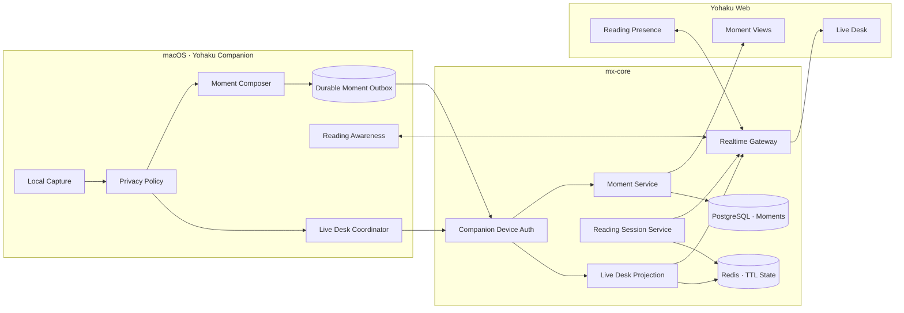
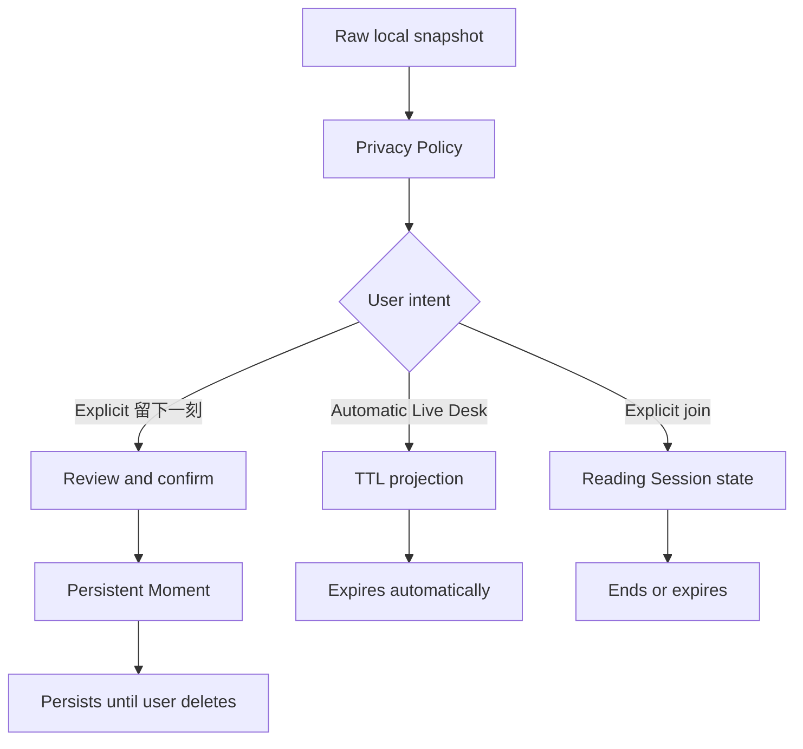
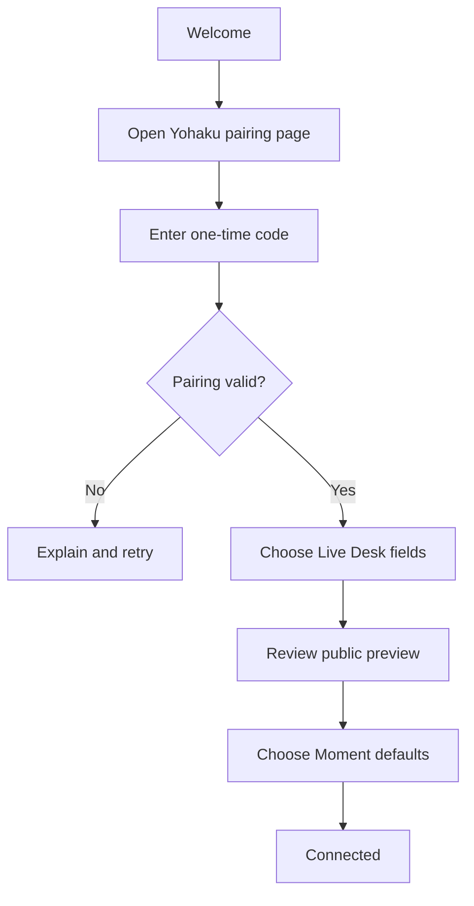
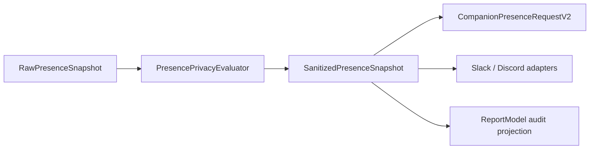
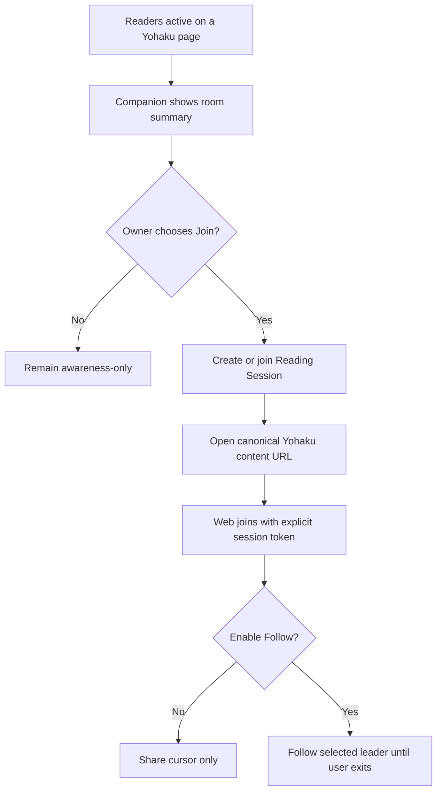
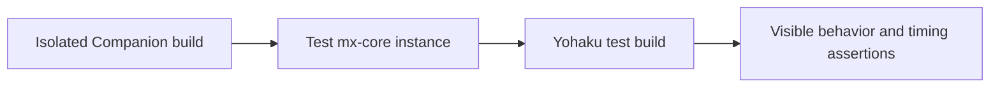

# Yohaku Companion 产品与跨端技术规格

| 字段 | 内容 |
| --- | --- |
| 文档状态 | Accepted，作为实现与验收基线 |
| 版本 | 1.7.3；保持与 Core 最低客户端版本契约一致 |
| 日期 | 2026-07-16 |
| 产品名称 | Yohaku Companion |
| 产品形态 | Apple Silicon (`arm64`) 上的 macOS 15+ 菜单栏应用，以及 Yohaku Web 对应的实时体验 |
| 涉及仓库 | `YohakuCompanion`、`Yohaku`、`mx-core`、`@mx-space/api-client` |
| 首期范围 | 产品重定位、Yohaku 一方连接、Live Desk、媒体进度同步、“留下一刻” |
| 后续范围 | 双向共同阅读 Session |

## 1. 文档目的

本规范定义独立产品 Yohaku Companion 作为 Yohaku 生态原生桌面伴生端的完整产品与技术边界，包括：

1. 独立应用身份与产品定位。
2. macOS 端、`mx-core`、Yohaku Web 之间的职责划分。
3. Live Desk 的实时状态、媒体时间轴与过期语义。
4. “留下一刻”的持久内容模型与交互流程。
5. 双向共同阅读所需的新 Session 领域与实时协议。
6. 隐私、安全、离线、迁移、测试和验收要求。

本规范是跨仓库实现的共同依据。Yohaku Companion 复用既有 Swift 代码，但工程、target、module、scheme 与源码目录统一使用 `YohakuCompanion`。正式 bundle identifier、Application Support 目录和 Keychain service 必须使用 Yohaku Companion 自己的命名空间，不读取、不复制且不隐式迁移 ProcessReporter 的数据或凭据。两个 App 可以同时安装；用户需要在 Yohaku Admin 中为 Yohaku Companion 重新配对。

### 1.1 与现有规范的关系

`PRESENCE_PRODUCT_UI_SPEC.md` 继续作为当前菜单栏、Settings、隐私规则、逐目的地投递结果和本地审计实现的基础规范。

本规范覆盖其下列产品层决策：

| 原决策 | 新决策 |
| --- | --- |
| 产品是通用个人 Presence 工具 | 产品是 Yohaku 生态的 macOS Companion |
| MixSpace、Slack、Discord 均为同级 Destination | Yohaku 为一方核心连接；Slack、Discord 为可选 Bridges |
| 工程与产品命名 | 工程技术标识与产品身份统一为 Yohaku Companion；仅保留必要的兼容标识 |
| Presence 是产品主体 | Presence 成为 Live Desk 的实时基础设施 |

现有规范中的下列边界保持有效：

- Raw Snapshot 仅存在于本机内存。
- Privacy Policy 在任何网络投递和持久化之前执行。
- S3 是 Asset Hosting，而不是 Presence Destination。
- Sync History 是本地审计，不是生产力分析。
- 凭据继续使用 Keychain／受保护的本地凭据边界。
- 原生 `NSMenu` 承载高频命令，SwiftUI Settings 承载低频配置。

## 2. 执行摘要

### 2.1 产品定义

Yohaku Companion 是 Yohaku 的原生 macOS 伴生端。它把用户主动允许分享的桌面状态、正在聆听的媒体和共同阅读关系送入 Yohaku，并允许用户把某个当下明确保存为“一刻”。

产品由三个相互独立但可组合的领域构成：

| 领域 | 核心语义 | 生命周期 | 默认可见性 |
| --- | --- | --- | --- |
| Live Desk | 此刻正在发生什么 | 短暂、可过期 | 明确开启后公开 |
| 留下一刻 | 我选择保存这一刻 | 持久、可编辑、可删除 | Private |
| 共同阅读 | 我们此刻在同一内容中相遇 | Session、参与者可随时离开 | 房间内可见 |

### 2.2 三条不可破坏的产品原则

| 原则 | 约束 |
| --- | --- |
| 实时不是监控 | Live Desk 只显示当前状态，不形成服务端活动轨迹或生产力记录 |
| 记录必须出于主动意图 | “留下一刻”必须由用户显式触发和确认，不得从 Sync History 自动生成 |
| 共读不是远程控制 | 任何跟随滚动或跳转都需要参与者显式加入，并可立即退出 |

### 2.3 发布策略

| 发布 | 内容 | 是否依赖新服务端领域 |
| --- | --- | --- |
| Release 1 | Companion 重定位、配对、Live Desk、媒体时间轴、“留下一刻” | 是：Companion、Moment |
| Release 2 | 活跃阅读感知、共同阅读 Session、可选跟随模式 | 是：Reading Session |
| Later | 截图、浏览器扩展、外部网页阅读、跨平台 Companion | 不在本规范承诺内 |

共同阅读的协议在本文中完整定义，但不作为 Release 1 的阻塞条件。

## 3. 核心产品决策

| 编号 | 决策 | 结论 |
| --- | --- | --- |
| D-01 | 产品名称 | 使用 `Yohaku Companion` |
| D-02 | 应用身份 | 使用 `YohakuCompanion` 工程、target、module、scheme 和源码目录，以及独立 bundle identifier、Application Support 与 Keychain 命名空间 |
| D-03 | 一方连接 | Yohaku Connection 成为核心连接；旧 MixSpace endpoint／token 不等同于设备配对 |
| D-04 | 第三方集成 | Slack、Discord 归类为 Bridges；不参与核心功能可用性判断 |
| D-05 | Live Desk 存储 | 服务端只保存带 TTL 的最新投影，不保存 Presence 时间序列 |
| D-06 | 媒体进度 | 使用时间轴锚点和前端本地推演，不进行每秒网络上报 |
| D-07 | 缺失播放位置 | 使用 `null`，不得以 `0` 代表“媒体源未提供位置” |
| D-08 | 一刻模型 | 使用独立 `Moment` 领域；不把私密内容强行复用为公开 `Recently` |
| D-09 | 一刻默认可见性 | Private；Public／Unlisted 必须由用户显式选择 |
| D-10 | 共读模型 | 使用独立 `ReadingSession`；不得继续堆叠现有 `ActivityPresence` |
| D-11 | 共读参与端 | 阅读和滚动发生在 Yohaku Web；Companion 负责感知、加入入口和状态反馈 |
| D-12 | 传输协议 | REST 负责初始状态和持久命令；WebSocket 负责实时投影和 Session 事件 |
| D-13 | 认证 | 使用可撤销、可限定 scope 的 Device Token；Token 不进入请求正文 |
| D-14 | 媒体 artwork | Release 1 不上传原始 artwork；后续只允许显式启用的短期资源 |
| D-15 | Presence payload | 采用全新的 Companion Protocol v2；旧结构只通过服务端 Legacy Adapter 兼容 |
| D-16 | 更新语义 | 每次 `PUT` 是完整快照原子替换；`application`、`media` 必须显式为对象或 `null` |
| D-17 | 时间单位 | 墙钟时间统一为 RFC 3339 UTC；duration／position 使用字段名明确的整数毫秒 |
| D-18 | 内部模型边界 | SwiftData `ReportModel` 不是网络 DTO，不得直接或间接自动序列化为一方 payload |
| D-19 | 资源字段 | v2 不接收 `iconBase64`；只接受经过验证的 HTTPS URL 或未来的受管 Asset ID |
| D-20 | 实时广播 | Application 与 Media 使用同一个 Public State、revision 和 `companion.presence.changed` 事件，不再拆分 `ps-update`／`media-update` |
| D-21 | 首发版本 | App 版本保持 `1.7.3`，不因产品独立发布重置为 `1.0.0`，以满足 Core 的最低客户端版本契约 |
| D-22 | 旧 App 关系 | 不读取、不复制、不导入 ProcessReporter 的偏好、History、Application Support 或 Keychain；两者可并存，Yohaku Companion 必须重新配对 |

## 4. 目标与非目标

### 4.1 目标

- 将现有可靠的本机采集、隐私清洗和投递基础转化为 Yohaku 一方体验。
- 让访问 Yohaku 的读者能够低干扰地感知站点所有者此刻的桌面状态。
- 在支持的播放器上展示平滑、低网络成本的媒体进度。
- 允许用户把当前桌面、媒体或 Yohaku 阅读上下文保存为一个持久的一刻。
- 为服务端尚未支持的双向共同阅读建立清晰、可实现且不侵犯参与者自主性的协议。
- 保留 Slack、Discord、Application Icon Hosting 和本地 Sync History 的既有能力。
- 以独立身份安装并与 ProcessReporter 并存，不对旧 App 做覆盖、替换或隐式数据迁移。

### 4.2 非目标

- 不提供应用使用时长、效率评分、专注度、工作统计或团队监控。
- 不把 Live Desk 变成全天活动回放。
- 不自动保存每首歌曲、每个窗口或每次应用切换。
- 不自动截屏，不读取屏幕内容，不通过 OCR 推断用户行为。
- 不在 Release 1 自动读取浏览器 URL；仅使用明确的 Yohaku 内容引用或用户输入的链接。
- 不承诺所有 macOS 播放器都能提供精确播放位置。
- 不在 Release 1 支持任意外部网页、PDF 或电子书的共同阅读。
- 不允许一方在未经同意时强制控制另一方的滚动位置。
- 不把内部 Function 事件名称或 Reporter Extension 暴露为产品概念。

## 5. 目标用户与核心任务

### 5.1 首期目标用户

首期面向拥有并维护一个 Yohaku／MixSpace 站点的单一所有者。站点读者不需要安装 Companion，即可在 Yohaku Web 中看到公开 Live Desk 状态并参与共同阅读。

### 5.2 用户任务

| 用户 | 任务 |
| --- | --- |
| 站点所有者 | 将 Companion 与自己的 Yohaku 实例安全配对 |
| 站点所有者 | 预览并控制哪些桌面和媒体字段会出现在 Live Desk |
| 站点所有者 | 随时暂停、恢复或清除公开状态 |
| 站点所有者 | 主动将当前上下文保存为一刻 |
| 站点所有者 | 看到哪些 Yohaku 内容正在被阅读，并选择加入 |
| 读者 | 感知站点所有者此刻的状态，但不接触敏感字段 |
| 读者 | 在明确加入后，与所有者共享阅读位置 |
| 所有参与者 | 在任何时刻退出共同阅读或停止跟随 |

## 6. 领域术语

| 术语 | 定义 |
| --- | --- |
| Companion | 独立安装的 Yohaku 原生 macOS 伴生端；工程技术标识统一为 `YohakuCompanion` |
| Yohaku Connection | Companion 与一个 Yohaku／MixSpace 实例之间的一方安全连接 |
| Raw Snapshot | 未经过隐私规则的本机采集结果，仅存在于内存 |
| Sanitized Snapshot | 经过 Privacy Policy 处理、允许离开设备的状态 |
| Live Desk Projection | Yohaku 可公开读取的最新、短期、可过期状态 |
| Lease | Live Desk Projection 在未收到刷新时仍有效的时长 |
| Media Timeline Anchor | 某一采样时刻的播放位置、播放速率与服务端归一化时间 |
| Moment／一刻 | 用户主动保存的持久上下文对象 |
| Reading Presence | 某个网页会话在某篇 Yohaku 内容中的阅读位置 |
| Reading Session | 一组明确加入、围绕同一 Yohaku 内容形成的临时共读关系 |
| Cursor | 阅读位置；由百分比和稳定内容锚点共同描述 |
| Bridge | 将已清洗状态映射到第三方服务的可选集成，如 Slack、Discord |

## 7. 当前实现基线与缺口

### 7.1 Yohaku Companion macOS

当前仓库由既有代码基础建立；工程、target、module、scheme 与源码目录已经统一为 `YohakuCompanion`。仅在明确的历史或兼容边界中允许保留旧标识，且旧标识不代表产品身份或持久化命名空间。

在独立应用拆分开始时，复用的 macOS 代码基础已经具备：

- 前台应用、窗口标题和媒体采集。
- 应用级 Privacy Policy、别名和隐藏规则。
- MixSpace、Slack、Discord 投递。
- S3 Application Icon Hosting。
- 菜单栏状态、Settings、Onboarding 和本地 Sync History。
- `MediaInfo.duration`、`MediaInfo.elapsedTime` 和 `playing`。
- MixSpace payload 中的 `duration` 与 `elapsedTime`。

这些初始缺口构成 Companion Protocol v2 与后续媒体时间轴工作的设计依据：

- `elapsedTime` 是非可空 `Double`，解析失败会退化为 `0`。
- 媒体语义去重键不包含 `elapsedTime`；只发生位置变化时不会刷新主缓存。
- 周期投递读取缓存值，不保证每次发送取得新鲜播放位置。
- 当前 Reporter 只把 `playing == true` 的媒体写入发送模型，无法向 Web 表达“曲目仍存在但已暂停”。
- MixSpace 是通用 Endpoint／Token 配置，不是具备设备身份和 scope 的一方连接。
- 没有 Moment outbox、Reading Session 或服务端下行订阅。

当前 `1.7.3` 实现已交付独立应用身份、capability preflight、一次性代码配对、包含 Application 与 Media 的 Sanitized Preview、显式 Live Desk consent、pause／remove 与生命周期清除。媒体时间轴按服务端 `mediaTimeline` capability 协商启用；当服务端不支持、媒体源关闭或当前无可发布媒体时，客户端通过 `media: null` 明确降级。Moment 与 Reading Session 仍按本文后续阶段交付。

### 7.2 Yohaku Web

当前 Web 已经具备：

- 通过 Companion Protocol v2 的公开 REST 端点取得初始 Live Desk state。
- 通过 `companion.presence.changed` Gateway event 接收实时完整快照，并在 socket 重连后主动 REST resync。
- 对 schema、nullable 字段、sequence、lease、server time 与媒体 timeline anchor 进行严格归一化和顺序归并。
- 统一表达 loading、active、idle、expired 与 transport degraded，并在 lease 到期后清除陈旧投影。
- 在顶部以 Live Desk paper slip 展示 Application 与 Media；hover popover 提供窗口标题、曲目信息、播放状态和可访问进度。
- 旧 `/fn/ps/update`、`fn#ps-update` 与 `fn#media-update` 路径继续作为 legacy activity 独立存在，不参与 Companion state 合并。
- 文章房间 Presence、阅读百分比和多人阅读轨道。

当前缺口：

- 没有 Moment 创建／展示模型。
- 网页 Presence 只能表达当前房间中的网页会话，不能表达明确的共读 Session。

### 7.3 mx-core 与 API Client

当前服务端已经具备：

- 独立 Companion Device、一次性 Pairing Code、scope、可撤销 Device Token 与受保护的设备凭据边界。
- Protocol v2 capability、minimum client version、payload limit、rate limit、lease、sequence、clear reason 与 request correlation。
- 原子 Live Desk Application／Media snapshot、短期 lease 存储、公开 REST 投影和 `companion.presence.changed` Gateway event。
- Admin 中的配对码生成、设备状态与撤销入口。
- `@mx-space/api-client` 5.5.0 的 Companion 类型、DTO 与控制器。
- 既有网页 `ActivityPresence`、内容房间、读者身份和实时 Gateway。

当前缺口：

- 没有持久 Moment 领域。
- 没有 Reading Session、角色、显式加入、跟随关系或稳定内容 Cursor。

### 7.4 旧 Function payload

当前 `/fn/ps/update` 示例具有以下结构性问题：

- 身份凭据通过正文 `key` 传输，容易进入 request dump、代理日志或错误回显。
- Application 与 Media 分别存储在 `ps` 和 `media` cache，TTL 分别为 300 秒和 10 秒，无法构成同一时刻的原子快照。
- Application 只比较 `name`，Media 只比较 `title`；artist、play／pause、seek、position、icon 和 description 变化不会可靠广播。
- Swift 请求中的 `timestamp` 使用 Unix seconds，Function 响应使用 Unix milliseconds，同名字段单位不一致。
- 缺少 schema、device、sequence、request ID、lease、clear reason 和能力协商。
- `iconBase64` 与 `iconUrl` 同时存在，缺少互斥和大小约束。
- 缺失字段与显式 `null` 没有定义，服务端容易把“未发送”误作“清除”。
- POST 响应返回更新前的 cached value，而不是写入后被接受的 canonical value。
- `ps-update` 与 `media-update` 分成两个事件，Web 可以短暂组合出从未真实存在的状态。

这些问题不通过继续增加可选字段解决。新客户端只发送 Companion Protocol v2；旧 Function payload 由服务端 Legacy Adapter 在有限迁移期内接收。

## 8. 总体架构



### 8.1 仓库职责

| 仓库／包 | 责任 |
| --- | --- |
| YohakuCompanion | 本机采集、隐私清洗、时间轴采样、配对、Moment outbox、菜单栏与 Settings |
| mx-core `apps/core` | Device Auth、Live Desk Projection、Moment、Reading Session、广播与 TTL |
| mx-core `packages/api-client` | 四端共享的请求、响应和事件类型 |
| Yohaku `apps/web` | Live Desk UI、媒体进度推演、Moment 展示、共同阅读参与体验 |

### 8.2 数据生命周期



## 9. 产品信息架构

### 9.1 macOS 菜单栏

```text
Yohaku Companion — Connected
✓ Share to Live Desk

LIVE DESK
  [App] Xcode — Editing
  [Media] Song — Artist                1:12 / 3:23

Leave This Moment…

READING NOW
  3 readers · “Article title”
  Join Reading…

BRIDGES
  Discord — Synced
  Slack — Disabled

Settings…                                  ⌘,
Quit Yohaku Companion                      ⌘Q
```

约束：

- Live Desk 项目只展示 Sanitized Snapshot。
- `Leave This Moment…` 是明确命令，不与自动投递复用交互。
- 没有活跃阅读房间时，隐藏 `READING NOW` 分组。
- Slack、Discord 位于 `BRIDGES`，不得影响 Yohaku Connection 的连接状态。
- Application Icon Hosting 不出现在主菜单。

### 9.2 Settings

| 页面 | 内容 |
| --- | --- |
| General | Launch at Login、全局暂停、权限与组件状态 |
| Yohaku | 实例、设备、连接健康度、Live Desk、Moment 能力 |
| Privacy | 全局字段默认值、应用规则、持久 Moment 默认值 |
| Bridges | Slack、Discord |
| History | 本地投递审计与 Moment outbox 状态 |
| Advanced | Media Provider、Application Icon Hosting、导入导出、诊断、更新与危险操作 |

现有 `Destinations` 页面迁移为 `Yohaku` 与 `Bridges`，但数据层可继续通过兼容 adapter 使用当前 Destination 实现。

### 9.3 Yohaku Web

Live Desk 具有两个呈现层级：

| 层级 | 位置 | 职责 |
| --- | --- | --- |
| Compact Activity | 现有 Header／Owner 区域 | 显示简短的应用或媒体状态，并进入完整 Live Desk |
| Live Desk Surface | 独立内容面；最终 URL 遵循 Yohaku locale route 约定 | 展示完整状态、媒体时间轴、安静／暂停状态和公开 Moments |

Release 1 不要求把所有活动信息长期固定在页面边缘；Live Desk 应保持 Yohaku 的低干扰、阅读优先视觉秩序。

## 10. Onboarding 与配对

### 10.1 流程



### 10.2 配对要求

- 用户从 Yohaku 管理端生成一次性配对码。
- 配对码有效期为 10 分钟，只能消费一次，不直接作为长期 Token。
- Companion 领取配对码后获得 `deviceId`、可撤销 Device Token 和服务端分配的 `nextSequence`。
- Device Token 保存在 Yohaku Companion bundle 专属的 CredentialStore／Keychain 边界中，不查询 ProcessReporter 的 Keychain service。
- 长期请求使用 `Authorization: Bearer <device-token>`。
- Token 不得写入 URL、请求正文、UserDefaults、History、日志或诊断导出。
- 每个 Token 具有明确 scope，至少包括：
  - `companion:presence:write`
  - `companion:moment:write`
  - `companion:reading:read`
  - `companion:reading:write`，仅在启用共读后授予
- Yohaku 管理端必须能够查看设备名称、最近活动时间并撤销设备。

### 10.3 首次公开保护

- 完成配对不等于立即公开 Live Desk。
- 用户必须看到一次基于当前 Sanitized Snapshot 的公开预览。
- 用户确认后才开启 `Share to Live Desk`。
- 新安装从安全默认值开始：Application On、Media On、Window Title Off；不导入 ProcessReporter 的隐私选择。
- 只有用户启用 Window Titles 后，Companion 才可请求 Accessibility 权限并读取当前窗口标题；关闭该来源时不得读取标题，Application identity 仍可独立工作。

## 11. Live Desk 产品规格

### 11.1 状态模型

| 状态 | 条件 | Web 表现 |
| --- | --- | --- |
| Disabled | 用户未启用 Live Desk | 不请求公开状态，隐藏组件或显示站点配置的静态占位 |
| Paused | 已连接但用户主动暂停 | 清除实时内容；可以显示通用安静状态，但不需要向公众解释暂停原因 |
| Idle | Lease 有效，但没有可分享的应用或媒体 | 显示低强调在线状态 |
| Active | Lease 有效，至少有一个公开字段 | 展示当前 Sanitized Snapshot |
| Stale | 客户端更新时间异常但 Lease 尚未正式到期 | 保留短暂过渡，不继续推进媒体时间轴 |
| Offline | Lease 到期或设备被撤销 | 清除实时内容，不把最后状态伪装为当前状态 |
| Degraded | 一方连接可用，但媒体位置或某个增强字段不可用 | 展示可用字段，不将整个 Live Desk 判定为失败 |

### 11.2 Lease

- 默认 heartbeat 为 30 秒。
- 默认 lease 为 90 秒。
- 服务端允许的 lease 范围为 30–120 秒。
- 客户端睡眠、锁屏、退出或主动暂停时应 best-effort 发送 clear。
- clear 未送达时，服务端必须依靠 lease 自动清除。
- 浏览器不得在 `expiresAt` 之后继续显示应用、窗口或媒体标题。

### 11.3 内容优先级

| 可用内容 | Compact Activity | Live Desk Surface |
| --- | --- | --- |
| Application + Media | 媒体为主、应用作为来源语境 | 同时展示，两者层级分明 |
| Media only | 媒体标题与艺术家 | 媒体时间轴与播放器名称 |
| Application only | 应用名称与可选描述 | 应用、可选窗口描述、更新时间 |
| Nothing shareable | 不展示活动图标 | Idle 文案 |

### 11.4 字段规则

- Bundle identifier、可执行路径、PID 和本机用户名永不进入公开投影。
- Window Title 仅在全局和应用规则同时允许时发送。
- 公开 payload 只包含用户可在 Companion Preview 中看到的字段。
- `iconUrl` 必须是可公开访问的 HTTPS URL；本机文件路径不得发送。
- 媒体 artwork 在 Release 1 不发送。
- 服务端不得通过日志记录公开 payload 之外的请求正文副本。

## 12. 媒体时间轴规格

### 12.1 结论

macOS 当前能够通过 MediaRemote 路径取得 `duration` 和 `elapsedTime`，但不同播放器可能不提供可靠位置。实现必须把“位置缺失”和“位于第 0 秒”表达为不同状态。

### 12.2 本机领域模型

```swift
enum MediaPlaybackState: String, Codable, Sendable {
    case playing
    case paused
    case stopped
}

enum MediaKind: String, Codable, Sendable {
    case music
    case podcast
    case video
    case unknown
}

struct MediaTimelineSample: Codable, Sendable {
    let sessionID: UUID
    let kind: MediaKind
    let title: String?
    let artist: String?
    let album: String?
    let playerName: String?
    let duration: Double?
    let position: Double?
    let sampledAt: Date
    let state: MediaPlaybackState
    let rate: Double
}
```

约束：

- `duration == nil` 表示媒体源未提供可靠总时长。
- `position == nil` 表示媒体源未提供可靠播放位置。
- `position == 0` 只表示已明确采样到第 0 秒。
- `rate` 在 Release 1 只允许 `0` 或 `1`；未来可支持播客倍速。
- Provider 未提供可信媒体类别时使用 `unknown`；不得仅凭标题文本推断类别。Release 1 可对明确的一方播放器标识采用受测试的映射。
- 当前 Provider 只有 `playing` Boolean 时，DTO 前的领域转换使用 playing → (`state = playing`, `rate = 1`)，paused → (`state = paused`, `rate = 0`)。
- 并发媒体会话必须分别采样播放状态。浏览器接管全局 Now Playing 后，一方播放器的暂停状态不得继续由其可能陈旧的 `playbackRate` 推断；播放器级 `isPlaying` 查询结果优先于该回退值。
- `sessionID` 是本机生成的短期 UUID，在媒体语义身份变化时更新；Wire DTO 将其编码为 `sessionId`。不得通过标题 hash 暴露额外身份信息。
- `position` 和 `duration` 必须为有限非负数。
- 已知 duration 时，position 在发送前 clamp 到 `[0, duration]`。
- Live Desk 的全局 Paused 与协议中的媒体 `state == paused` 是两个不同状态；当前 Companion 发布策略不保留暂停媒体。
- 曲目从 playing 进入 paused 后立即清除媒体字段并重置媒体会话连续性，不继续心跳续租旧曲目。
- Provider 明确返回 stopped 或 no-media 时同样立即清除媒体。

### 12.3 采样与事件分离

当前 `MediaInfoSnapshotKey` 的去重职责应拆成两层：

| 层 | 职责 |
| --- | --- |
| Latest Sample Store | 每次成功采样都更新最新 position、sampledAt 和状态 |
| Semantic Change Key | 只在曲目、播放器、play／pause、artwork 或元数据变化时触发高优先级事件 |

仅有播放位置自然推进时：

- 更新 Latest Sample Store。
- 不触发每秒网络上报。
- 不创建新的 Sync History 事件。

发生以下情况时立即生成新时间轴锚点：

- 曲目改变。
- play／pause／stop 改变。
- 新位置与上一锚点的预期位置偏差超过 2 秒，视为 seek。
- 设备唤醒、网络恢复或 WebSocket 重连。
- heartbeat 到达 30 秒校准点。

### 12.4 发送前新鲜度

- Live Desk 发送路径不得只读取 `MediaInfoManager.getMediaInfo()` 的旧缓存。
- 在媒体字段将被发送时，Coordinator 应执行有界异步 fresh fetch；建议 timeout 1–2 秒。
- fresh fetch 暂时 unavailable 时，可以使用仍在最大年龄内的 Latest Sample，并标记为 estimated。
- 样本年龄超过 10 秒且无法刷新时，将 `position` 设为 `null`；不得继续推演陈旧位置。
- Provider 明确返回 no-media 时，必须清除媒体状态，不能回退到旧曲目。

### 12.5 服务端归一化

DTO 将本机 seconds 转为 `positionMs`，并与 `sampledAt` 一起发送。服务端在接收时生成 Web 可直接使用的毫秒锚点：

```text
networkDeltaMs = receivedAt - sampledAt

if abs(networkDeltaMs) <= 30000 and state == playing:
  advancedPositionMs = positionMs + clamp(networkDeltaMs, 0, 5000) * rate
else:
  advancedPositionMs = positionMs

anchorPositionMs = round(
  max(
    0,
    durationMs == null ? advancedPositionMs : min(advancedPositionMs, durationMs)
  )
)

anchorAt = receivedAt
```

若请求的 positionMs 为 `null`，公开 Projection 的 positionMs 也必须为 `null`。否则公开 `playback.positionMs` 等于上述 anchorPositionMs，并明确表示 `anchorAt` 时刻的位置。

### 12.6 Web 本地推演

```text
displayPositionMs = clamp(
  anchorPositionMs + (serverNow - anchorAt) * rate,
  0,
  durationMs
)
```

浏览器要求：

- 使用现有 server time offset，而不是直接相信本机墙钟。
- `state != playing` 或 `rate == 0` 时停止推进。
- 页面不可见时无需逐帧渲染；恢复可见时从当前时间重新计算。
- 不通过 `setInterval(1000)` 累加位置，避免 background throttling 累积误差。
- 使用 animation frame 或低频视觉更新，但每次都从锚点公式重新计算。
- positionMs 或 durationMs 缺失时隐藏进度条，只展示媒体元数据。
- Lease 到期时立即停止推演并清除当前媒体。

### 12.7 质量目标

| 指标 | 目标 |
| --- | --- |
| 支持播放器的正常播放漂移 | 校准间隔内不超过 2 秒 |
| play／pause Web 可见延迟 | 正常网络下 p95 ≤ 3 秒 |
| seek Web 可见延迟 | 正常网络下 p95 ≤ 3 秒 |
| 网络上报频率 | 稳态不超过每 30 秒一次；语义事件除外 |
| 缺失位置误报 | 不得把 unavailable 显示为 0:00 |

## 13. Companion Protocol v2

Companion Protocol v2 是面向一方 Yohaku Connection 的第一个正式版本化协议；旧的无版本 `/fn/ps/update` 视为 Legacy，而不是 v1。v2 不是旧 payload 的字段扩展。旧 payload 只存在于迁移适配器中；新的 macOS、mx-core 和 Yohaku 代码不得以旧字段为内部 canonical model。

以下路径均相对于 mx-core 当前 API prefix；实现不得在业务 controller 内再次硬编码全局版本前缀。

### 13.1 旧结构与 v2 的对应原则

| 旧结构问题 | 直接影响 | v2 决策 |
| --- | --- | --- |
| 正文 `key` | Credential 进入 payload 和日志面 | `Authorization: Bearer` |
| `process`、`media` 分开缓存 | 页面组合出不存在的混合状态 | 一个完整 Snapshot 原子替换 |
| 分别使用 300s／10s TTL | Application 和 Media 独立过期 | Snapshot 共用一个 lease |
| 只比较 name／title | pause、artist、seek、icon 等变化丢失 | sequence + canonical revision |
| `timestamp` 单位不一致 | 时间解释错误 | RFC 3339 UTC + 明确 `*Ms` 字段 |
| absent／null 无语义 | 无法区分未提供和清除 | 必填 nullable context |
| `iconBase64`／`iconUrl` 并列 | 体积和优先级不可控 | HTTPS URL；禁止 base64 |
| 响应返回旧 cache | 客户端收到被覆盖前状态 | 响应只返回写入后 canonical state |
| split realtime events | Web 出现竞态和撕裂 | 单一 revision、单一事件 |
| `ReportModel` 驱动传输 | 持久化结构泄漏到网络契约 | 独立 domain snapshot 与 DTO |

### 13.2 协议原则

- Presence 使用 domain-specific endpoint，不建设无类型的通用 `/events` ingestion。
- 所有设备请求使用 `{ meta, data }`；成功响应使用 `{ meta, data }`；失败响应使用 `{ meta, error }`。
- Wire format 固定为 UTF-8 JSON、camelCase key 和 `Content-Type: application/json`；不使用表单字段或二进制混合正文。
- `meta` 只承载协议、设备、排序和追踪信息；业务内容只进入 `data`。
- `PUT /companion/presence` 是完整快照，不是 merge patch。
- `application` 与 `media` 在快照中都必须出现，其值只能是完整对象或 `null`。
- 服务端先验证并归一化完整 payload，再一次性替换 device projection；不存在部分成功。
- Token、scope、bundle identifier、PID、可执行路径和本地诊断不属于 payload。
- v2 所有结构对象使用严格 schema；未知字段返回验证错误，不静默保存。
- Breaking change 提升 `schemaVersion`；可选功能通过 capabilities 协商。

### 13.3 Endpoint

| Method | Path | Auth | 用途 |
| --- | --- | --- | --- |
| `GET` | `/companion/capabilities` | Public | 协商 schema、最低客户端版本和功能 |
| `POST` | `/companion/pairings` | Owner session | 创建一次性配对码 |
| `POST` | `/companion/pairings/claim` | Pairing code | 领取 Device Token |
| `GET` | `/companion/devices` | Owner session | 管理已配对设备 |
| `DELETE` | `/companion/devices/:id` | Owner session | 撤销设备并清除其 Projection |
| `PUT` | `/companion/presence` | Device Token | 原子替换完整 Presence Snapshot |
| `POST` | `/companion/presence/clear` | Device Token | 有序清除当前 Projection |
| `GET` | `/companion/presence/public` | Public | 初始读取公开 Projection |

不使用无正文 `DELETE /companion/presence`，因为 clear 必须携带 sequence 和 request ID，才能与并发 snapshot 建立确定顺序。

### 13.4 通用 Envelope

```ts
interface CompanionRequestMeta {
  schema: string
  schemaVersion: number
  requestId: string
  deviceId: string
  observedAt: string
}

interface OrderedCompanionRequestMeta extends CompanionRequestMeta {
  sequence: number
}

interface CompanionRequest<TData> {
  meta: CompanionRequestMeta
  data: TData
}

interface OrderedCompanionRequest<TData> {
  meta: OrderedCompanionRequestMeta
  data: TData
}

interface CompanionResponseMeta {
  schema: string
  schemaVersion: number
  requestId: string
  serverTime: string
}

interface CompanionSuccess<TData> {
  meta: CompanionResponseMeta
  data: TData
}

interface CompanionFailure<TError> {
  meta: CompanionResponseMeta
  error: TError
}
```

字段要求：

| 字段 | 语义 |
| --- | --- |
| `schema` | Presence 固定为 `yohaku.companion.presence` |
| `schemaVersion` | v2 固定为整数 `2` |
| `requestId` | 每个逻辑操作唯一的 UUID 或 ULID；同一操作的重试复用，只用于追踪和响应关联 |
| `deviceId` | Pairing 产生的公开设备标识，必须与 Bearer Token 绑定设备一致 |
| `sequence` | 每 device 单调递增的非负安全整数，不超过 `Number.MAX_SAFE_INTEGER` |
| `observedAt` | Sanitized Snapshot 完成采集的 RFC 3339 UTC 时间，保留毫秒 |

Device Token 只通过 HTTP Authorization header 发送。所有 Presence mutation 还必须携带 `X-Yohaku-Companion-Version` header，其值为客户端的 SemVer 版本；服务端在消费 sequence 前按 `minimumClientVersion` 强制校验。`requestId` 不是独立幂等键；Presence 的排序与幂等边界由 sequence 决定，Moment 的幂等由其 domain data 决定。

Sequence 规则：

- Pairing 初始化 accepted sequence；客户端将下一个 sequence 与 Device Token 一起持久化。
- 请求超时后的逻辑等价重试复用相同 sequence 和 requestId；服务端在有界 idempotency retention window 内按 schema 归一化后的 canonical payload fingerprint 判断等价性，并返回第一次接受时的结果，不依赖 JSON key 顺序。Snapshot 的窗口不超过其 lease，Clear 的窗口不超过服务端最大 lease。
- 等价重试不得再次延长 lease、递增 revision 或广播事件，避免同一报文被无限 replay 成 heartbeat。
- idempotency window 到期后，服务端只保留不含内容的 accepted sequence；相同旧 sequence 返回 `409 COMPANION_SEQUENCE_CONFLICT`，不得恢复已过期的应用、窗口或媒体内容。
- 相同 sequence 但不同 requestId 或不同 canonical payload 返回 `409 COMPANION_SEQUENCE_CONFLICT`。
- 更小 sequence 返回 `409 COMPANION_SEQUENCE_STALE`，并在安全 error details 中给出 accepted sequence，允许客户端恢复计数器。
- 更大 sequence 经完整验证后原子接受；验证失败不得消耗 sequence。
- 只有 canonical device state 的原子提交可以消费新 sequence；在提交前产生的 `401`／`403`／`422`／`426`／`429` 或 `5xx` 不得消费。提交成功但响应丢失时，由等价重试读取已保存结果。
- 服务端永远使用 receivedAt 决定 lease，不使用客户端 observedAt 作为过期依据。
- macOS 端由单一 actor／串行管线分配 sequence 和发送 Presence；不得由 heartbeat、media callback 与 pause handler 各自并发构造序号。
- 一个请求在途时，后续 Snapshot 只保留最新 desired state；Clear 是不可跨越的顺序屏障，必须先于其后产生的 Snapshot 被接受。
- sequence 在首次发送前持久化保留；进程崩溃导致序号跳跃是合法的，服务端不得要求连续递增。

### 13.5 Presence Snapshot 请求

```json
{
  "meta": {
    "schema": "yohaku.companion.presence",
    "schemaVersion": 2,
    "requestId": "01K0A5Q2R7Y5VXG4H7Q0F4M9J2",
    "deviceId": "01K0A4VDWYSH1JQH4PGY4QM8YT",
    "sequence": 124,
    "observedAt": "2026-07-16T12:00:00.000Z"
  },
  "data": {
    "availability": "active",
    "lease": {
      "ttlSeconds": 90
    },
    "application": {
      "displayName": "Xcode",
      "activity": {
        "key": "editing",
        "customLabel": null
      },
      "window": null,
      "icon": {
        "url": "https://assets.example.com/apps/xcode.png"
      }
    },
    "media": {
      "sessionId": "01K0A5PXA7KPKN6VBYF6M52M2R",
      "kind": "music",
      "title": "Track title",
      "artist": "Artist",
      "album": null,
      "player": {
        "displayName": "Music"
      },
      "playback": {
        "state": "playing",
        "durationMs": 203000,
        "positionMs": 72400,
        "sampledAt": "2026-07-16T11:59:59.600Z",
        "rate": 1
      }
    }
  }
}
```

### 13.6 Presence Snapshot 字段语义

```ts
type LiveDeskAvailability = 'idle' | 'active'
type MediaKind = 'music' | 'podcast' | 'video' | 'unknown'
type MediaPlaybackState = 'playing' | 'paused'

interface CompanionPresenceDataV2 {
  availability: LiveDeskAvailability
  lease: { ttlSeconds: number }
  application: CompanionApplicationContext | null
  media: CompanionMediaContext | null
}

interface CompanionApplicationContext {
  displayName: string
  activity: {
    key: string | null
    customLabel: string | null
  } | null
  window: { title: string } | null
  icon: { url: string } | null
}

interface CompanionMediaContext {
  sessionId: string
  kind: MediaKind
  title: string | null
  artist: string | null
  album: string | null
  player: { displayName: string } | null
  playback: {
    state: MediaPlaybackState
    durationMs: number | null
    positionMs: number | null
    sampledAt: string
    rate: number
  }
}
```

完整快照规则：

- `availability == active` 时，application 和 media 至少一个非 `null`。
- `availability == idle` 时，application 和 media 必须都为 `null`。
- v2 声明的所有 key 都必须出现；nullable 字段使用 JSON `null`，不得通过省略表达。此规则同样适用于 activity、window、icon、player 与媒体元数据等嵌套字段。
- `lease.ttlSeconds` 是客户端请求值，服务端按 capabilities 与 30–120 秒安全范围 clamp；实际期限只以响应 expiresAt 为准。
- 稳态 heartbeat 重新发送完整 Snapshot 以刷新 lease，不存在只刷新部分字段的 heartbeat patch。
- 缺少 application 或 media 字段是 invalid payload；清除某个 context 必须显式发送 `null`。
- `PUT` 成功后，服务端不得保留上一个 Snapshot 中未出现在新对象里的 context 或子字段。
- `window == null` 表示未分享窗口信息；不得以空字符串代替隐私隐藏。
- `activity.key` 必须匹配 `^[a-z][a-z0-9.-]{0,63}$`；已知 key 由 Yohaku 按 locale 翻译。
- `customLabel` 只用于用户明确配置的自定义描述；非空时优先于 activity.key 的翻译。
- `activity.key` 与 `customLabel` 都为 `null` 时，Web 使用通用“正在使用”文案。
- v2 不允许发送本地化的硬编码 `description` 作为协议语义。
- `icon.url` 只接受 HTTPS，并且 host 必须属于站点配置的 Asset Hosting／custom-domain allowlist，避免把访问者请求导向任意追踪域名。
- `iconBase64` 在 v2 是 schema error，不被静默忽略。
- media 至少具有非空 title 或 artist；完全没有可展示身份的媒体必须作为 `media: null`。
- `sessionId` 是当前连续播放条目的设备侧随机 UUID／ULID，不是音乐目录 ID。title、artist、album、duration 或 player 形成的语义身份改变时生成新值；pause、resume 和 seek 保持不变；应用重启或 Provider 连续性不可确认时允许生成新值。
- 不得以媒体标题等用户内容直接生成可逆或跨设备稳定的 `sessionId`。
- `sessionId` 只随 ephemeral Presence lease 存活；Moment 不保存该字段，服务端也不得把它建设为跨会话媒体画像键。
- media stopped／no-media 通过下一完整 Snapshot 的 `media: null` 表达，不保留空媒体对象。
- 所有字符串在客户端进行首尾空白清理并归一化为 Unicode NFC；可空字段清理后为空时发送 `null`，required displayName 为空时拒绝构造 DTO。

### 13.7 时间与数值

- 墙钟时间均使用 RFC 3339 UTC 字符串并保留毫秒，例如 `2026-07-16T12:00:00.180Z`。
- 传输层 duration 与 position 只使用非负整数毫秒，字段名固定为 `durationMs` 和 `positionMs`。
- Swift 内部仍可用 `Double` seconds；DTO mapper 负责有限值检查、clamp 和四舍五入，不允许各调用点自行换算。
- `positionMs == null` 表示媒体源没有可靠位置；真实开头使用 `0`。
- `durationMs == null` 表示没有可靠总时长。
- 两者都存在时，服务端允许最多 2 秒采样容差，之后将 position clamp 到 duration。
- `rate` 必须为有限值且位于 `[0, 4]`；Release 1 的 macOS 端只产生 `0` 或 `1`。
- `state == paused` 时 rate 必须为 `0`；`state == playing` 时 rate 必须大于 `0`。不一致的组合返回字段验证错误。
- `sampledAt` 描述媒体位置采样时间；`meta.observedAt` 描述完整 Presence Snapshot 时间，两者不得合并。
- observedAt／sampledAt 是不受信任的设备时间。服务端只在允许的 clock-skew 窗口内用于锚点归一化，不用于授权、排序或 lease。

### 13.8 Clear 命令

```json
{
  "meta": {
    "schema": "yohaku.companion.presence",
    "schemaVersion": 2,
    "requestId": "01K0A5TQBX9V9RNXNT0F4M7E7S",
    "deviceId": "01K0A4VDWYSH1JQH4PGY4QM8YT",
    "sequence": 125,
    "observedAt": "2026-07-16T12:00:03.000Z"
  },
  "data": {
    "reason": "paused"
  }
}
```

允许的 owner-diagnostic reason：`paused`、`sleep`、`shutdown`、`privacyChanged`、`connectionRemoved`。公开事件只表达更新后的完整 Public State，不向访客暴露内部 reason。

- Clear 与 Snapshot 共享同一 device sequence。
- 晚到且 sequence 更小的 clear 不得删除更新后的 Snapshot。
- `privacyChanged` 用于规则收紧时先清除旧公开状态；随后可以发送新的 Sanitized Snapshot。
- 正常退出的 clear 仍受有界退出时间限制；未送达时由 lease 兜底。

### 13.9 成功响应

```json
{
  "meta": {
    "schema": "yohaku.companion.presence",
    "schemaVersion": 2,
    "requestId": "01K0A5Q2R7Y5VXG4H7Q0F4M9J2",
    "serverTime": "2026-07-16T12:00:00.180Z"
  },
  "data": {
    "acceptedSequence": 124,
    "receivedAt": "2026-07-16T12:00:00.180Z",
    "state": {
      "schemaVersion": 2,
      "epoch": "01K0A5P1KD0QAFMZKVFNFC7AFN",
      "revision": 8451,
      "projection": {
        "availability": "active",
        "updatedAt": "2026-07-16T12:00:00.180Z",
        "expiresAt": "2026-07-16T12:01:30.180Z",
        "application": {
          "displayName": "Xcode",
          "activity": {
            "key": "editing",
            "customLabel": null
          },
          "window": null,
          "icon": {
            "url": "https://assets.example.com/apps/xcode.png"
          }
        },
        "media": {
          "sessionId": "01K0A5PXA7KPKN6VBYF6M52M2R",
          "kind": "music",
          "title": "Track title",
          "artist": "Artist",
          "album": null,
          "player": {
            "displayName": "Music"
          },
          "playback": {
            "state": "playing",
            "durationMs": 203000,
            "positionMs": 72980,
            "anchorAt": "2026-07-16T12:00:00.180Z",
            "rate": 1
          }
        }
      }
    }
  }
}
```

- `data.state` 是本次设备写入完成后重新计算的站点级公开状态，而不是未经筛选的 device snapshot。
- `state.projection` 是经过验证、时间归一化和公开字段过滤的 canonical value；没有有效设备状态时为 `null`。
- 服务端不得返回更新前 cache，不得回显 Authorization header 或原始请求正文。
- `state.epoch` 在 Projection store 初始化时生成；Redis 丢失／重建状态时必须产生新 epoch。
- 同一 epoch 内，`state.revision` 使用站点级 Redis `INCR` 产生的安全整数，并且只在公开 State 改变时递增。
- Web 在 epoch 相同时只接受更大 revision；epoch 变化时无条件接受新基线并清除旧比较状态。
- Snapshot 与 Clear 成功响应完全复用上述结构。Clear 后没有其他有效设备时，`state.projection` 为 `null`；存在 fallback device 时，返回重新选择后的完整 Projection。
- 一个已接受但没有改变当前公开 State 的设备操作可以返回现有 revision，且不得重复广播事件。

### 13.10 错误响应

```json
{
  "meta": {
    "schema": "yohaku.companion.presence",
    "schemaVersion": 2,
    "requestId": "01K0A5Q2R7Y5VXG4H7Q0F4M9J2",
    "serverTime": "2026-07-16T12:00:00.180Z"
  },
  "error": {
    "code": "COMPANION_PAYLOAD_INVALID",
    "message": "Presence snapshot is invalid.",
    "retryable": false,
    "retryAfterMs": null,
    "acceptedSequence": null,
    "fields": ["data.media.playback.positionMs"]
  }
}
```

- `fields` 只包含 schema path，不回显被拒绝的字段值。
- stale／conflict 错误可以通过 `acceptedSequence` 返回服务端当前计数；其他错误使用 `null`。
- `400` 用于无法解析的 JSON envelope；`401` 用于缺失、无效或已撤销的 Device Token；`403` 用于 scope 不足。
- `409` 用于 stale sequence 或相同 sequence 的请求冲突。
- `422` 用于 schema／字段验证失败。
- `426` 用于最低客户端版本或 schema 不受支持。
- `429` 必须返回 `Retry-After`，并在 error 中提供 `retryAfterMs`。
- `413` 用于超过 payload 上限；`415` 用于不支持的 media type。
- 只有 2xx 表示 Snapshot 已成为当前 device canonical state。

### 13.11 公开 State 与 Projection

```ts
interface PublicLiveDeskStateV2 {
  schemaVersion: 2
  epoch: string
  revision: number
  projection: PublicLiveDeskProjectionV2 | null
}

interface PublicLiveDeskProjectionV2 {
  availability: 'idle' | 'active'
  updatedAt: string
  expiresAt: string
  application: PublicApplicationPresenceV2 | null
  media: PublicMediaPresenceV2 | null
}

type PublicApplicationPresenceV2 = CompanionApplicationContext

interface PublicMediaPresenceV2 {
  sessionId: string
  kind: MediaKind
  title: string | null
  artist: string | null
  album: string | null
  player: { displayName: string } | null
  playback: {
    state: MediaPlaybackState
    durationMs: number | null
    positionMs: number | null
    anchorAt: string
    rate: number
  }
}

type CompanionPresenceMutationSuccess = CompanionSuccess<{
  acceptedSequence: number
  receivedAt: string
  state: PublicLiveDeskStateV2
}>

type PublicPresenceReadSuccess = CompanionSuccess<{
  state: PublicLiveDeskStateV2
}>
```

公开 State／Projection 不包含：

- deviceId、requestId、sequence、Device Token 或 scope；
- bundle identifier、PID、可执行路径和本机用户名；
- 未经过 Privacy Policy 允许的 window title；
- Provider 状态、采样误差、本地错误和诊断；
- Legacy credential、Function cache key 或原始 payload。

公开 GET 成功响应的 `data.state` 与 `companion.presence.changed` 事件 payload 必须逐字段复用同一个 `PublicLiveDeskStateV2` 类型和 normalizer。`projection: null` 是已初始化但当前无可公开 Presence 的正常状态，不使用 `404` 表达。GET 没有客户端 request ID 时，响应 meta 使用服务端生成的 request ID。

### 13.12 原子缓存与广播

- Redis 以 device 为粒度保存一个版本化 Snapshot，不再分别保存 `ps` 和 `media`。
- Snapshot／clear、accepted sequence、lease、设备选择与 Public State 重算必须在一个原子操作中完成。
- Device sequence 只负责单设备请求排序；Public epoch／revision 由服务端按站点全局生成，以覆盖多设备选择、clear、expiry、revoke 和 Projection store 重建。
- revision 只在完整 `PublicLiveDeskStateV2` 改变时递增；事件 payload 必须是该 revision 对应的完整 State。
- 选中设备的 heartbeat 会改变 `updatedAt`／`expiresAt`，因此构成 Public State 更新并广播；未选中设备的操作如果没有改变公开结果，则不递增 revision。
- 所有公开变化只广播 `companion.presence.changed`。Snapshot、clear、lease expiry、revoke 或 fallback device 选择不得使用不同的 v2 事件类型。
- clear／expiry 后若仍有有效 fallback device，事件携带该设备的完整 Projection；只有没有有效设备时才携带 `projection: null`。
- Expiry 使用按 deadline 排序的 Redis 索引和幂等 reaper／scheduler 触发重算；不得把不保证投递的 Redis keyspace notification 作为唯一清除机制。公开 GET 也必须在读取时排除 `expiresAt <= serverNow` 的 Snapshot。
- Deadline 索引只用于加速；每条 device record 的 `expiresAt` 才是读取时的有效性依据。Lease 或有界 idempotency window 到期后必须删除 Projection、canonical fingerprint 与 accepted response，仅可保留不含内容的 sequence counter。
- Web 永远以单一 revision 替换完整 Public State，不分别合并 application 和 media event。
- Release 1 公共 Projection 选择最近更新且 lease 有效的单一 device；不同 device 的 context 不得混合。

### 13.13 macOS 领域与 DTO 边界



- `SanitizedPresenceSnapshot` 是一方上报、Bridge 映射、Preview 与审计投影的共同 domain input。
- `ReportModel` 保留为 SwiftData compatibility／audit projection，不是 canonical Presence model。
- `CompanionPresenceRequestV2` 是手写、版本化、不可变 Codable DTO；只从 Sanitized Snapshot 构造。
- Swift DTO 必须显式编码 nullable key；不能依赖会对 Optional 调用 `encodeIfPresent` 的默认合成行为。
- DTO 不得引用 `FocusedWindowInfo`、`MediaInfo`、`NSImage` 或其他 transient raw type。
- Bridge adapters 继续产生各自 provider payload，但不得反向影响一方协议字段。
- 网络层不得使用字典拼接或 `ReportModel` 的反射式序列化。

### 13.14 Legacy Adapter

Legacy Adapter 只部署在服务端，用于一个明确发布周期内接收旧 `/fn/ps/update` 请求。

| 旧字段 | v2 映射 |
| --- | --- |
| `key` | 仅用于 legacy endpoint 鉴权，不复制到 canonical payload |
| `timestamp` seconds | 转为 RFC 3339 `observedAt`；无效时使用 server receivedAt |
| `process.name` | `application.displayName` |
| `process.description` | 校验后映射为 `application.activity.customLabel`；不解析为 window 或 activity key |
| `process.iconUrl` | 校验后映射为 `application.icon.url` |
| `process.iconBase64` | 不进入 v2 Projection；忽略并记录无内容诊断计数 |
| `media.title`／`artist` | 对应媒体字段 |
| `media.duration`／`elapsedTime` seconds | 校验后乘以 1000，标记为 legacy estimated sample |
| `media.processName` | `media.player.displayName` |

适配规则：

- Legacy 请求映射到一个稳定的 synthetic device，并由服务端生成 sequence。
- Application 与 Media 在同一次 legacy POST 中被归一化为一个原子 Snapshot，统一使用 90 秒 lease。
- 缺少有效 `process.name` 时 application 为 `null`；缺少可展示 title／artist 时 media 为 `null`；两者都为空时生成 `availability: idle`，不得合成空名称。
- 旧协议没有 pause／stop／sampledAt，适配器不得声称具有精确播放状态；有 media 时只能产生 estimated playing anchor。
- Legacy Adapter 为同一 synthetic device 维护短期媒体语义身份，并生成不含内容信息的随机 `sessionId`；标题、作者、专辑、时长或播放器改变时轮换，不直接散列用户内容作为公开 ID。
- 兼容期间可以从统一 Public State 派生旧 `fn#ps-update`／`fn#media-update` 给旧 Web，但新 Web 只消费 `companion.presence.changed`。
- 新 Companion 不双发 v2 与 legacy payload；capability 可用时只发送 v2。
- 迁移期结束后同时删除 legacy endpoint、正文 key 鉴权、split cache 和 split broadcast。

### 13.15 版本协商、限制与限流

`/companion/capabilities` 至少返回：

```ts
interface CompanionCapabilities {
  minimumClientVersion: string
  presenceSchemaVersions: number[]
  momentSchemaVersions: number[]
  features: {
    liveDesk: boolean
    mediaTimeline: boolean
    moments: boolean
    readingSessions: boolean
  }
  limits: {
    presencePayloadBytes: number
    presenceRequestsPerMinute: number
    presenceLeaseMinSeconds: number
    presenceLeaseMaxSeconds: number
    recommendedHeartbeatSeconds: number
    maximumClockSkewSeconds: number
  }
}
```

默认限制：

| 项目 | 默认值 |
| --- | --- |
| Presence payload | 32 KiB |
| Application display name | 120 Unicode scalar |
| Window title | 500 Unicode scalar |
| Activity key | 64 ASCII characters |
| Activity custom label | 80 Unicode scalar |
| Media title／artist／album | 各 300 Unicode scalar |
| Player display name | 120 Unicode scalar |
| HTTPS icon URL | 2048 bytes |
| Presence rate | 每 device 每分钟 30 次 |
| Presence lease | 最短 30 秒，最长 120 秒 |
| Recommended heartbeat | 30 秒 |
| Maximum clock skew | 30 秒；超出后不校准播放位置 |
| Moment rate | 每 device 每小时 60 次 |
| Reading Cursor rate | 每 participant 每秒 4 次 |

- Companion 在配对前和服务端返回 `COMPANION_SCHEMA_UNSUPPORTED` 后刷新 capabilities。
- 低于最低安全版本的客户端停止发送，并提供升级入口；服务端同时拒绝缺少、格式非法或低于最低版本的 `X-Yohaku-Companion-Version`，返回 `426 COMPANION_SCHEMA_UNSUPPORTED`。
- 支持 Companion Protocol v2 的 Core 必须始终返回 `features.liveDesk: true`，Presence mutation 与 public read 随服务启动直接可用，不设置独立环境变量或运行时硬门。配对凭证、客户端 Sanitized Preview 与显式 Live Desk consent 才是写入和公开状态的授权边界；`features.liveDesk` 继续保留用于协议兼容与旧服务端识别。
- Presence 收到 `429` 时只保留最新 Snapshot，不排队重放中间状态。
- Reading Cursor 收到 `429` 时合并为最新 Cursor，不重放滚动轨迹。
- 服务端必须在持久化／广播前重新执行长度、类型、URL scheme、finite number 和授权校验。

## 14. 实时事件契约

### 14.1 新事件

| Event | Scope | Payload |
| --- | --- | --- |
| `companion.presence.changed` | Public visitor | `PublicLiveDeskStateV2` |
| `companion.device.revoked` | Owner device | `{ deviceId, revokedAt }` |
| `reading.room.activity` | Owner devices | 活跃房间摘要 |
| `reading.session.updated` | Session room | Session 与 participant 变化 |
| `reading.cursor.updated` | Session room | 单个 participant Cursor |
| `reading.session.ended` | Session room | 结束原因与时间 |

### 14.2 迁移

- Yohaku Web 首期同时支持 `companion.presence.changed` 和旧 `fn#ps-update`／`fn#media-update`。
- 新事件到达后，以 Public State 为权威并停止将旧事件写入同一 atom。
- 旧 `/fn/ps/update` 保留一个发布周期，期间只做兼容读取。
- 当所有受支持 Companion 版本完成迁移后，删除旧 Function 事件与五分钟活动轮询。
- 新事件必须在 `@mx-space/api-client` 中具有共享类型；不得由 Web 和 Core 各自手写不一致接口。

## 15. “留下一刻”产品规格

### 15.1 定义

“留下一刻”是用户主动将当前已清洗上下文与一段可选文字保存为持久内容的行为。它不是 Sync History 的导出，也不是自动活动日志。

### 15.2 入口

- 菜单栏 `Leave This Moment…`。
- 可配置全局快捷键，默认不占用系统常用组合键。
- Yohaku Web 的内容页可通过受验证的 Universal Link／custom URL scheme 请求 Companion 打开 Moment Composer，并附带 Yohaku content reference。
- Companion 不从任意浏览器窗口标题推导 URL。

### 15.3 Composer

Composer 至少包含：

1. 可选文字，允许为空。
2. 当前时间。
3. 当前 application context Toggle。
4. 当前 media context Toggle。
5. Window Title Toggle；即使 Live Desk 允许，持久保存仍默认 Off。
6. Yohaku content reference；仅在由可信 Yohaku 页面发起时出现。
7. Visibility：Private、Unlisted、Public；默认 Private。
8. Preview。
9. `Save Moment` 主操作与 `Cancel`。

至少存在文字或一个 context 时才能保存。

### 15.4 数据模型

```ts
type MomentVisibility = 'private' | 'unlisted' | 'public'

interface Moment {
  id: string
  idempotencyKey: string
  text: string | null
  visibility: MomentVisibility
  clientCreatedAt: string
  createdAt: string
  modifiedAt: string | null
  context: {
    application: {
      displayName: string
      activity: {
        key: string | null
        customLabel: string | null
      } | null
      window: { title: string } | null
      icon: { url: string } | null
    } | null
    media: {
      kind: 'music' | 'podcast' | 'video' | 'unknown'
      title: string | null
      artist: string | null
      album: string | null
      player: { displayName: string } | null
      playback: {
        state: 'playing' | 'paused'
        durationMs: number | null
        positionMs: number | null
      }
    } | null
    content: {
      type: 'post' | 'note' | 'page'
      id: string
      canonicalPath: string
      title?: string
      progress?: number
    } | null
  }
}
```

Moment 保存的是确认时的静态快照，不保存短期 `sessionId` 或持续推进的媒体锚点。`positionMs` 只是该时刻的上下文，不能在 Moment 页面继续播放式推进。

### 15.5 Device 创建 payload

Device Token 创建 Moment 时复用 `{ meta, data }` 结构，但使用独立 schema，且不复用 Presence sequence：

```json
{
  "meta": {
    "schema": "yohaku.companion.moment",
    "schemaVersion": 1,
    "requestId": "01K0A7JQD9MAB7CM82RF2Q02FN",
    "deviceId": "01K0A4VDWYSH1JQH4PGY4QM8YT",
    "observedAt": "2026-07-16T12:08:00.000Z"
  },
  "data": {
    "idempotencyKey": "01K0A7JA20NKM23WFK5ASR30GN",
    "clientCreatedAt": "2026-07-16T12:07:58.000Z",
    "text": "这一刻值得留下。",
    "visibility": "private",
    "context": {
      "application": null,
      "media": null,
      "content": null
    }
  }
}
```

- Presence sequence 只描述 ephemeral Projection 的顺序，不得被 Moment 复用。
- Moment 的重复提交由 `idempotencyKey` 处理；相同 device 与 key 必须返回同一 canonical Moment。
- `meta.observedAt` 是 Composer 确认时刻；`clientCreatedAt` 是用户希望保存的一刻，可以因为离线编辑而更早。
- Device 创建响应遵循 `{ meta, data }`，data 为 canonical Moment；错误遵循 `{ meta, error }`。
- Owner Web session 创建／编辑 Moment 使用相同 domain data schema，但通过 owner session 鉴权，不要求 deviceId。

### 15.6 Endpoint

| Method | Path | Auth | 用途 |
| --- | --- | --- | --- |
| `POST` | `/moments` | Device Token／Owner session | 创建一刻 |
| `GET` | `/moments` | Owner session | 管理全部可见性的一刻 |
| `GET` | `/moments/public` | Public | 获取公开一刻 |
| `GET` | `/moments/:id` | Visibility policy | 获取单个一刻 |
| `PATCH` | `/moments/:id` | Owner session | 编辑文字或可见性 |
| `DELETE` | `/moments/:id` | Owner session | 删除一刻 |

### 15.7 与 Recently 的边界

- Moment 是独立持久领域，因为它需要 Private／Unlisted、结构化 context 和设备幂等语义。
- `Recently` 保持现有公开短内容语义，不承载私密 Moment。
- 后续可以提供 `Publish as Recently` 显式操作，但不得在创建 Moment 时自动复制。
- Public Moment 可以进入 Yohaku 时间线聚合，但其来源类型必须保持为 `moment`，不能伪装为 Recently。

### 15.8 离线与幂等

- 创建 Moment 使用 UUID／ULID `idempotencyKey`。
- 在线失败后写入本地 Durable Outbox，保存用户已确认的 Sanitized Moment。
- Outbox 重试不得重复创建服务端记录。
- 重试采用指数退避，并在菜单与 History 中显示 Pending／Failed／Saved。
- 用户可以编辑仍未上传的 Moment、立即重试或删除本地副本。
- Presence 不进入 outbox；Reading Cursor 不进入 outbox。
- 日志和诊断只能记录 Moment ID、状态和固定错误码，不记录文字与 context。

### 15.9 Public Moment 呈现

- 使用 Yohaku 既有纸张、留白和时间线设计语言。
- Application 与 Media 是次级语境，不应压过用户文字。
- 没有文字时，context 可以成为主体。
- 不展示 bundle identifier、设备名称或本机路径。
- 删除或改为 Private 后，Web cache 必须失效。
- Private Moment 只在 owner-authenticated 管理界面出现；Unlisted Moment 使用不可枚举 URL 并设置 `noindex`。
- Public Moment 是否进入搜索索引遵循站点级 SEO 设置，不因创建来源是 Companion 而获得额外公开范围。

## 16. 双向共同阅读规格

### 16.1 当前判断

现有 `ActivityPresence` 已能表达“网页会话正在某个 room 的某个百分比”，但不能表达：

- 原生设备身份。
- 显式共读 Session。
- Session owner／participant 角色。
- 加入、离开、结束和重连。
- 跟随关系与同意。
- 稳定内容锚点。
- Companion 接收站点活跃阅读房间的 owner-only 事件。

因此，共同阅读必须新增 `ReadingSession`，而不是为 `ActivityPresence` 继续增加可选字段。

### 16.2 Release 2 范围

Release 2 只支持 Yohaku 自有内容：Post、Note、Page。阅读发生在 Yohaku Web，Companion 不内嵌网页阅读器。

能力分为两层：

| 层 | 能力 |
| --- | --- |
| Reading Awareness | Companion 看到当前有哪些内容正在被阅读、人数和最近活动 |
| Reading Together | 所有者创建／加入 Session，参与者共享 Cursor，并可显式启用 Follow |

### 16.3 用户流程



### 16.4 Session 模型

```ts
type ReadingContentType = 'post' | 'note' | 'page'
type ReadingSessionState = 'active' | 'idle' | 'ended'
type ReadingParticipantRole = 'host' | 'participant'

interface ReadingSession {
  id: string
  content: {
    type: ReadingContentType
    id: string
    canonicalPath: string
    revision?: string
  }
  state: ReadingSessionState
  hostIdentity: string
  createdAt: string
  expiresAt: string
  participants: ReadingParticipant[]
}

interface ReadingParticipant {
  identity: string
  role: ReadingParticipantRole
  displayName?: string
  joinedAt: string
  updatedAt: string
  cursor?: ReadingCursor
  followingIdentity?: string
}

interface ReadingCursor {
  progress: number
  anchor?: {
    blockId?: string
    headingId?: string
    offsetRatio?: number
  }
  updatedAt: string
}
```

### 16.5 Cursor 语义

- `progress` 限制在 `[0, 100]`，作为跨布局回退值。
- `blockId` 是渲染器提供的稳定内容块 ID，优先于纯百分比。
- `headingId` 用于内容版本变化或 block 不存在时的次级定位。
- `offsetRatio` 描述锚点块内位置，限制在 `[0, 1]`。
- 内容 revision 不一致时，客户端不得盲目跳转到未知 block；回退到 heading，再回退到 progress。
- Cursor 更新建议 debounce 500–1000ms；不得逐滚动事件上报。

### 16.6 Follow 模式

- 默认关闭。
- 用户必须选择一个明确的 participant 才能开始 Follow。
- 开始 Follow 时显示可见状态和 `Stop Following` 操作。
- 用户主动滚动、按 `Esc`、切换页面或关闭 Session 时立即退出 Follow。
- 领导者不能强制其他参与者进入 Follow。
- Follow 只影响当前 Yohaku 内容，不允许触发外部导航。
- 跳转采用平滑、可中断滚动，并尊重 Reduce Motion。

### 16.7 Session 生命周期

| 事件 | 结果 |
| --- | --- |
| Host 创建 | Session 进入 Active，默认 lease 5 分钟 |
| Participant 加入 | 广播 participant joined |
| Cursor 更新 | 刷新 participant TTL，广播最新 Cursor |
| Participant 60 秒无更新 | 标记 idle，不再作为 Follow leader |
| Participant 120 秒无更新 | 从活跃 participant 移除 |
| Host 离开 | Session 进入 Idle，允许 2 分钟重连 |
| Host 超过重连窗口 | Session Ended |
| Host 主动结束 | 立即 Ended，广播结束原因 |

Release 2 不持久保存 Session Cursor 历史。结束后的 Session 状态最多保留 24 小时用于防重与诊断，之后删除。

### 16.8 Endpoint

| Method | Path | Auth | 用途 |
| --- | --- | --- | --- |
| `GET` | `/reading/rooms/active` | Owner Device Token | Companion 获取活跃内容摘要 |
| `POST` | `/reading/sessions` | Owner／Reader session | 创建 Session |
| `GET` | `/reading/sessions/:id` | Session policy | 初始加载 |
| `POST` | `/reading/sessions/:id/join` | Web session | 显式加入 |
| `POST` | `/reading/sessions/:id/cursor` | Joined participant | 更新 Cursor |
| `POST` | `/reading/sessions/:id/leave` | Joined participant | 离开 |
| `POST` | `/reading/sessions/:id/end` | Host | 结束 Session |

### 16.9 与现有 ActivityPresence 的关系

- 现有 ActivityPresence 继续承担普通网页“同页读者”展示。
- Reading Awareness 可以聚合普通 ActivityPresence 的房间人数，但只向 owner scope 暴露必要摘要。
- 创建 Session 后，参与者具有独立 Session membership；不得仅凭处于相同 room 自动加入。
- Session Cursor 和普通 ActivityPresence 可以使用同一滚动采样源，但拥有不同授权、TTL 和事件名称。
- Awareness 摘要默认只包含内容标识、标题、人数和最近活动时间；不向 Companion 下发访客 IP、邮箱或匿名会话标识。
- Companion 默认不为每位读者进入发送系统通知；只在菜单中安静更新。通知必须由用户显式开启并进行合并限频。

## 17. macOS 应用改造

### 17.1 目标模块边界

```text
YohakuCompanion/
├── Companion/
│   ├── Connection/
│   ├── LiveDesk/
│   ├── Moments/
│   ├── Reading/
│   └── Realtime/
├── Presence/
│   ├── Capture/
│   ├── Policy/
│   ├── Delivery/
│   ├── Assets/
│   └── Persistence/
├── Features/
│   ├── MenuBar/
│   ├── Onboarding/
│   └── Settings/
└── Core/
    └── MediaInfoManager/
```

该结构表达所有权，不要求一次性移动所有文件。

### 17.2 现有对象迁移

| 当前对象 | 目标职责 |
| --- | --- |
| `Reporter` | 逐步拆分为 Capture Coordinator、Live Desk Coordinator 和 Bridge Delivery Coordinator |
| `MixSpaceReporterExtension` | 迁移为 first-party `YohakuPresenceClient`；旧 endpoint adapter 暂时保留 |
| `ReporterExtension` | 仅作为 Slack／Discord Bridge 兼容边界 |
| `MediaInfoManager` | 提供 Latest Sample Store 与 Semantic Change Stream |
| `ReportModel` | 继续承载本地兼容审计；不得成为新的网络契约类型 |
| `PresencePrivacyEvaluator` | 继续作为 Live Desk 与 Moment Composer 的共同清洗事实来源 |
| `DataStore` | 增加 Moment outbox；与 Sync History 明确分表／分模型 |
| `PresenceMenuBarModel` | 增加 Yohaku Connection、Live Desk、Moment 和 Reading 状态 |

### 17.3 一方连接与 Bridges

- `Yohaku Connection` 的 Ready 是 Live Desk 和 Moment 的必要条件。
- Slack／Discord 失败时，Companion 可显示 Bridge Degraded，但 Yohaku Connection 仍可为 Connected。
- 暂停 Live Desk 不默认清除 Slack／Discord；Settings 提供是否联动的明确选项，默认联动以减少意外暴露。
- 用户必须能够仅关闭第三方 Bridges，而保留 Yohaku。

### 17.4 睡眠、锁屏与退出

- 睡眠和屏幕锁定时立即停止采集并 best-effort clear Presence。
- 唤醒或解锁后重新获取 fresh snapshot，不重放睡眠前状态。
- 正常退出在 500ms 的有界窗口内尝试 clear；不得无限阻塞退出。
- 异常退出依靠 lease 清除。

## 18. Yohaku Web 改造

### 18.1 状态层

新增独立 Live Desk 状态，不继续把所有字段塞入当前 `activityAtom`：

```ts
interface LiveDeskState {
  phase: 'disabled' | 'loading' | 'active' | 'idle' | 'quiet' | 'offline'
  publicState: PublicLiveDeskStateV2 | null
  transport: 'rest' | 'socket'
}
```

要求：

- 初始 REST query 与 socket event 使用同一 normalizer。
- `publicState == null` 只表示尚未完成第一次读取；服务端的“当前无状态”使用 `publicState.projection == null`。
- epoch 相同且 revision 小于或等于当前值的事件不得覆盖新状态；epoch 改变或 REST reconnect sync 重新建立权威基线。
- socket 重连后重新读取一次公开投影，修复可能丢失的事件。
- React Query cache 与 Jotai 状态必须有单一写入适配层。
- 当前五分钟 polling 仅作为迁移期 fallback，不能承担实时语义。

### 18.2 组件

| 组件 | 职责 |
| --- | --- |
| `LiveDeskCompactActivity` | Header／Owner 区域的简短入口 |
| `LiveDeskSurface` | 完整状态与空状态 |
| `MediaTimeline` | 基于 anchor 的可访问进度条 |
| `MomentCard` | Public Moment 展示 |
| `ReadingRoomSummary` | 活跃房间摘要 |
| `ReadingSessionRail` | Session participant 与 Cursor |
| `FollowReadingControl` | 显式进入／退出 Follow |

### 18.3 Accessibility

- 媒体进度条提供当前时间、总时长和播放／暂停状态的 accessible value。
- 进度视觉更新不得每秒触发冗长的 VoiceOver announcement。
- Follow 状态必须被读屏识别，并提供始终可达的停止按钮。
- Reduced Motion 下禁用持续位移动画，使用离散位置更新。
- Live Desk 的颜色不能作为在线、暂停或异常的唯一信息载体。

### 18.4 Localization

- 所有新增用户文案必须覆盖 Yohaku 当前启用的 `en`、`zh`、`zh-TW`、`ja` 和 `ko` locale。
- 产品名、Live Desk 和 Moment 等品牌术语遵循统一 terminology 表，不在组件中硬编码。
- 媒体时间采用 locale-aware 格式；进度条 accessible value 不拼接只适用于英语的句式。
- Reading participant、人数和“其他 N 人”继续使用各 locale 的复数与量词规则。
- macOS 与 Web 对同一连接状态使用语义一致的文案，但允许根据平台长度约束采用不同短句。

## 19. mx-core 与 API Client 改造

### 19.1 新模块

| 模块 | 存储 | 职责 |
| --- | --- | --- |
| `CompanionModule` | PostgreSQL + Redis | Pairing、Device、scope、Presence lease |
| `MomentModule` | PostgreSQL | Moment CRUD、visibility、幂等 |
| `ReadingSessionModule` | Redis | Session、participant、Cursor、TTL |
| `CompanionGatewayAdapter` | Gateway | 强类型公共和 owner-only 事件 |

### 19.2 存储约束

- Pairing code 只存 hash，并设置 10 分钟 TTL。
- Device Token 只存 hash；明文只在 claim 成功响应中出现一次。
- Live Desk Projection 保存在 Redis，不写入 Activity 数据表。
- Moment 写入 PostgreSQL，context 使用版本化结构。
- Reading Session 和 Cursor 保存在 Redis，不写入长期活动表。
- Presence、Moment text 和 Cursor 不进入通用 request log。

### 19.3 API Client

`@mx-space/api-client` 必须提供：

- `CompanionController`
- `MomentController`
- `ReadingSessionController`
- 所有请求／响应模型。
- Socket event payload 类型。
- legacy response adapter 不应成为新契约的必经路径。

Core、Yohaku 和后续管理端必须消费这些共享类型；不得复制 JSON interface。

## 20. 隐私与安全

### 20.1 数据分类

| 数据 | 分类 | 处理 |
| --- | --- | --- |
| Raw window title | Sensitive local | 仅内存，规则允许后才进入 snapshot |
| Bundle ID／path／PID | Local diagnostic | 永不公开 |
| Sanitized application／media | User-approved public context | 仅在 Live Desk 开启时发送 |
| Moment text | Private content by default | 加密传输，按 visibility 授权 |
| Reading Cursor | Ephemeral participant state | Session 内可见，TTL 删除 |
| Device Token | Secret | Keychain；服务端只存 hash |

### 20.2 最小权限

- Device Token 只能访问其 scope 对应的 endpoint。
- Presence write Token 不能读取私密 Moments。
- Moment write Token 不能修改其他 owner 数据。
- Public Live Desk endpoint 只返回公开投影。
- Owner-only 阅读房间摘要不得暴露访客 IP、邮箱或未公开身份资料。

### 20.3 撤销与清除

- 撤销设备时立即删除其 Redis Presence、关闭其 owner realtime channel，并拒绝后续请求。
- `Erase All App Data` 删除本机 Device Token、Moment outbox 与相关缓存。
- 删除 Moment 后使 Web cache、搜索索引和公开聚合失效。
- 暂停 Live Desk 不删除 Moments。

### 20.4 URL Scheme 安全

- Yohaku Web 发起 Moment Composer 时只允许 `https` 且 host 与已配对实例匹配。
- content reference 必须由服务端签发短期 nonce 或在打开后由 API 重新解析。
- 自定义 URL 参数中的标题和路径只作为非权威显示提示，保存前以服务端内容对象为准。
- 不允许 URL Scheme 携带 Device Token。

## 21. 离线、冲突与恢复

| 数据类型 | 离线策略 | 重连策略 |
| --- | --- | --- |
| Live Desk | 不排队旧快照 | 发送最新 fresh snapshot，并建立新 lease |
| Media semantic event | 不逐条排队 | 发送当前曲目和当前锚点 |
| Moment | 写入 durable outbox | 按 idempotency key 重试 |
| Reading Cursor | 丢弃 | 重新加入 Session 后发送当前 Cursor |
| Clear Presence | best effort | 服务端 lease 兜底；若本地 desired state 仍为暂停／禁用，重连后先发送新的有序 clear |

冲突规则：

- 服务端以 device sequence 拒绝乱序 Presence。
- Moment 更新采用 `modifiedAt`／revision 乐观并发；冲突时不静默覆盖，返回可恢复错误。
- Reading Cursor 使用 last-write-wins，但只接受当前 membership epoch 的更新。
- 设备重新加入 Session 时生成新的 membership epoch，旧 socket 的更新失效。

## 22. 错误模型与诊断

### 22.1 稳定错误码

至少定义：

| Code | 含义 |
| --- | --- |
| `COMPANION_PAIRING_EXPIRED` | 配对码已过期 |
| `COMPANION_DEVICE_REVOKED` | 设备已被撤销 |
| `COMPANION_SCOPE_DENIED` | Token scope 不足 |
| `COMPANION_SCHEMA_UNSUPPORTED` | 客户端 schema 或版本不受支持 |
| `COMPANION_FEATURE_UNAVAILABLE` | 可选 Companion 功能不可用；保留用于旧服务端兼容，当前 Live Desk 不返回此错误 |
| `COMPANION_SEQUENCE_STALE` | Presence sequence 过期 |
| `COMPANION_SEQUENCE_CONFLICT` | 相同 sequence 对应了不同请求或 canonical payload |
| `COMPANION_PAYLOAD_INVALID` | 契约校验失败 |
| `MOMENT_CONFLICT` | Moment revision 冲突 |
| `MOMENT_VISIBILITY_DENIED` | 无权读取或修改 Moment |
| `READING_SESSION_ENDED` | Session 已结束 |
| `READING_MEMBERSHIP_STALE` | membership epoch 失效 |

### 22.2 诊断原则

- 本地诊断包含连接阶段、HTTP status、固定错误码、最近成功时间和 Provider capability。
- 不包含 Token、Endpoint query、Moment text、窗口标题、媒体标题或 Reading Cursor。
- 服务端指标按 endpoint、状态码、延迟和事件类型聚合，不使用内容字段作为 label。
- 支持一次性导出 redacted diagnostics，继续遵循现有 Credential fail-closed 规则。

## 23. 性能与可靠性目标

| 指标 | 目标 |
| --- | --- |
| Live Desk 语义事件端到端延迟 | 正常网络 p95 ≤ 3 秒 |
| Presence heartbeat | 30 秒，允许系统调度抖动 |
| Presence 自动清除 | 最迟在 90 秒 lease 到期后完成 |
| Moment 在线创建响应 | 正常网络 p95 ≤ 5 秒 |
| Moment 重试重复记录 | 0 |
| Reading Cursor 端到端延迟 | 正常网络 p95 ≤ 1.5 秒 |
| Companion 空闲 CPU | 不因 Live Desk 引入持续高频唤醒 |
| Web 后台标签 CPU | 不运行持续 animation frame |
| Socket 断线恢复 | 重连后通过 REST／state sync 达到最终一致 |

## 24. 品牌与独立应用身份

### 24.1 发布边界

| 边界 | Yohaku Companion 决策 | 与 ProcessReporter 的关系 |
| --- | --- | --- |
| 产品与安装包 | 独立的 `Yohaku Companion` App | 不覆盖旧 App，可同时安装和运行 |
| Bundle identifier | Release 使用 `dev.innei.YohakuCompanion`；Debug 使用独立调试标识 | 不沿用 ProcessReporter bundle identifier |
| Application Support | 以当前 Yohaku Companion bundle identifier 建立目录 | 不读取、不复制旧目录 |
| Keychain／保护凭据 | service 名称由当前 bundle identifier 派生 | 不查询或迁移 ProcessReporter credential service |
| Yohaku Device | 首次运行通过一次性配对码创建新设备 | 不复用旧 token，必须重新配对 |
| 工程内部名称 | project、target、module、scheme 与源码目录统一使用 `YohakuCompanion` | 旧标识仅允许出现在明确的历史或兼容边界中 |
| App 版本 | 保持 `1.7.3` | 满足 Core 的 `minimumClientVersion`，不因换产品身份重置版本 |

### 24.2 安装与数据约束

- 安装 Yohaku Companion 不卸载、覆盖或修改 ProcessReporter。
- 不提供隐式迁移、首次启动扫描、Keychain 复制或旧 Application Support 导入。
- 用户如需继续使用 ProcessReporter，可让两个 App 并存；两者拥有独立偏好、History、Icon Cache、Privacy Rules 与凭据。
- Yohaku Companion 必须通过 Yohaku Admin 新生成的一次性代码重新配对，并在预览后显式启用 Live Desk。
- 仅 Yohaku Companion 自己后续版本之间允许使用版本化的内部 schema／偏好迁移；此类迁移不得跨越到 ProcessReporter 命名空间。
- 旧 MixSpace endpoint／token 不自动转化为 Yohaku Connection；新的配对必须先完成 capability 检查。

## 25. 实施阶段

### Phase 0：契约与兼容基础

- 在 `@mx-space/api-client` 定义 Companion Protocol v2、Moment 和事件类型。
- 建立 capabilities、schema negotiation 和最低客户端版本边界。
- 在 mx-core 建立 Device／Pairing 和 Redis Presence Projection。
- macOS 增加 `SanitizedPresenceSnapshot`、v2 DTO mapper 和 Yohaku Connection client，但保留旧 MixSpace 投递。
- 服务端增加有时限的 Legacy Adapter，把旧 Function payload 映射成统一 Public State。
- Yohaku Web 增加新状态 normalizer 和旧事件 fallback。

完成条件：测试实例能够安全配对、写入、读取和自动过期一条无媒体的 v2 Projection；旧 payload 只能经 Legacy Adapter 进入同一 canonical Public State。

### Phase 1：Live Desk 与独立产品发布

- 以独立 App 身份发布 Yohaku Companion。
- 重组 Onboarding、菜单栏和 Settings 信息架构。
- Yohaku 增加 Compact Activity 与 Live Desk Surface。
- 完成 pause、clear、lease、sequence、reconnect 和多设备选择。

完成条件：不依赖 Slack／Discord 即可完成 Yohaku 一方完整体验；ProcessReporter 与 Yohaku Companion 可并存且数据完全隔离，Yohaku Companion 重新配对后才可启用 Live Desk。

### Phase 2：媒体时间轴

- `duration`／`position` 改为可空。
- 拆分 Latest Sample 与 Semantic Change。
- DTO 唯一负责 seconds 到 integer milliseconds 的转换。
- 发送前 fresh fetch、seek 检测和 30 秒锚点校准。
- mx-core 完成 anchor 归一化。
- Yohaku 完成本地推演和无位置降级。

完成条件：支持播放器的进度平滑且漂移达标；不支持播放器时从不显示虚假的 0:00。

### Phase 3：“留下一刻”

- mx-core Moment CRUD、visibility 和幂等。
- macOS Composer、Preview 和 durable outbox。
- Yohaku Public Moment 与 owner 管理入口。
- URL Scheme／content reference 验证。

完成条件：在线与离线创建均不会重复；默认 Private；公开范围可撤销且缓存及时失效。

### Phase 4：旧活动链路退役

- 观察新协议稳定性。
- 停止 Yohaku 五分钟 activity polling。
- 删除 `fn#ps-update`、`fn#media-update` 与 `/fn/ps/update` 兼容路径。
- 将 MixSpace first-party connection 与 Bridge UI 完全分离。

完成条件：受支持客户端全部使用新契约，回滚策略经过验证。

### Phase 5：共同阅读

- Reading Awareness owner channel。
- Reading Session、membership epoch、Cursor anchor 与 TTL。
- Companion 活跃房间入口。
- Yohaku join／leave／follow 体验。

完成条件：参与者必须显式加入；Follow 可立即退出；Session 结束后不保留 Cursor 历史。

## 26. 验证策略

### 26.1 macOS 行为测试

- Privacy Policy 在 Live Desk 和 Moment 两条路径上产生一致的 Sanitized Snapshot。
- v2 DTO 只从 Sanitized Snapshot 构造，不携带 bundle ID、PID、path 或 transient raw type。
- 完整 Snapshot 对 application／media 使用显式对象或 `null`，不会误保留前一版本字段。
- Codable wire test 验证所有 nullable key 实际编码为 JSON `null`，而不是被 Optional 默认省略。
- seconds 到 integer milliseconds 只在 DTO mapper 中发生，nil、0、非有限值和 clamp 边界正确。
- missing elapsedTime 保持 `nil`，真实第 0 秒保持 `0`。
- 自然播放位置推进只更新 Latest Sample，不产生每秒投递。
- 媒体语义身份、play／pause、seek、唤醒和重连触发正确锚点。
- fresh fetch 超时后按样本年龄正确降级。
- 睡眠、锁屏、暂停、退出和设备撤销清除 Presence。
- Moment outbox 在重试、编辑和删除时保持幂等。
- Yohaku Companion 不读取 ProcessReporter 的偏好、Keychain、History 或 Bridge 配置；首次运行保持安全默认值并要求重新配对。

### 26.2 mx-core 契约测试

- Pairing code 单次消费和过期。
- Device Token hash、scope、撤销和清除。
- v2 strict schema 拒绝正文 key、iconBase64、未知字段和缺失 context。
- Presence sequence 拒绝乱序，lease 正确过期。
- 相同 sequence／requestId／canonical payload 的重试返回首次结果，且不刷新 lease 或重复广播；相同 sequence 的不同 payload 返回 conflict。
- 晚到 clear 不删除更新后的 Snapshot。
- 成功响应返回设备操作完成后重新计算的 canonical Public State，而不是旧 cache。
- Application 与 Media 在同一 Redis 原子操作中更新和过期。
- Legacy Adapter 的 seconds、旧字段与 synthetic device 映射正确，且不会创建 split cache。
- 多设备公共投影不混合字段。
- Expiry reaper、公开读取时过期过滤和 fallback device 重选产生一致的 Public State。
- Clock skew 和 media anchor 归一化。
- Moment visibility、幂等、冲突和删除。
- Reading membership epoch、TTL、host reconnect 和 end。
- Public endpoint 永不返回私有字段。

### 26.3 Yohaku 行为测试

- 初始 REST 与 socket event 达到相同状态。
- 单一 Public State／revision 原子替换 application 与 media，不出现 split-event tearing。
- socket 丢事件后重连修复状态。
- fake clock 下媒体进度公式、pause、seek、expiry 正确。
- position 缺失时隐藏进度而非显示 0:00。
- epoch／revision 防止旧事件覆盖新事件，并允许 Projection store 重建后建立新基线。
- Moment 从 Public 变为 Private 后立即从公开视图消失。
- Follow 只能显式进入，用户滚动和 `Esc` 可退出。
- 不同 viewport／内容 revision 下 Cursor 回退顺序正确。

### 26.4 端到端验证



- 使用 Debug 专属 bundle identifier 和临时用户目录进行 macOS runtime test。
- 不修改 Yohaku Companion 正式安装或 ProcessReporter 的偏好、Keychain、Application Support 或数据库。
- 至少使用一个能提供位置的播放器和一个不提供位置的媒体源验证降级。
- 模拟睡眠、离线、重连、乱序、时钟偏移和设备撤销。
- 对同一旧 payload 与对应 v2 Snapshot 验证公开 Public State 的兼容结果；新客户端不得双发。
- 使用真实 WebSocket 验证而非仅 mock reducer。

### 26.5 测试约束

- 不添加只复述静态 enum、字段表、scope 数组或 JSON 常量的 snapshot test。
- 优先验证可观察行为、授权边界、过期、幂等和此前可能失败的边缘条件。
- 视觉检查使用明确场景与可访问性检查表，不以内部 DOM snapshot 代替交互验证。

## 27. 最终验收标准

### 27.1 产品与品牌

- [ ] 面向用户的产品不再以通用“进程报告器”自我描述。
- [ ] Yohaku 是首要连接，Slack／Discord 明确归类为 Bridges。
- [ ] UI、文档和 Onboarding 统一使用正式名称 Yohaku Companion 与同一术语表。
- [ ] Yohaku Companion 使用独立 bundle identifier、Application Support 和 Keychain service；不发生跨 App 隐式迁移。
- [ ] ProcessReporter 与 Yohaku Companion 可并存；新 App 需重新配对且配对后仍默认不公开。
- [ ] App 版本保持 `1.7.3`，通过 Core 最低客户端版本协商。

### 27.2 Live Desk

- [ ] 用户可在公开前预览所有将被发送的字段。
- [ ] Pause、sleep、lock、quit 和 revoke 均能清除或最终过期状态。
- [ ] 服务端不保存 Presence 时间序列。
- [ ] 乱序 update 不会使 Web 回退到旧状态。
- [ ] 多设备不会形成拼接状态。
- [ ] 正常网络下语义事件 p95 在 3 秒内可见。

### 27.3 Companion Protocol v2

- [ ] 新客户端不再发送正文 `key`、`process`、`media.elapsedTime` 或 `iconBase64` 旧结构。
- [ ] 每次 Presence `PUT` 原子替换完整 application／media Snapshot。
- [ ] absent、`null`、真实 `0` 与 unavailable 均有确定且被测试的语义。
- [ ] 所有 duration／position 传输字段以 `*Ms` 明确命名，并使用安全整数。
- [ ] Clear 与 Snapshot 共用 device sequence，晚到 clear 不会清除新状态。
- [ ] 成功响应、公开 GET 和 WebSocket 事件使用同一 canonical `PublicLiveDeskStateV2`，epoch／revision 可处理乱序与存储重建。
- [ ] `ReportModel` 不作为网络 DTO；旧 payload 只能通过服务端 Legacy Adapter 进入系统。
- [ ] Application 与 Media 不再使用不同 TTL、不同 cache key 或不同 revision。

### 27.4 媒体进度

- [ ] `nil` 与真实 `0` 被正确区分。
- [ ] 不需要每秒网络请求即可平滑推进。
- [ ] play／pause 与 seek 正确更新锚点；媒体语义身份变化生成新的 `sessionId` 并重置锚点。
- [ ] unsupported provider 只降级进度，不隐藏可用媒体元数据。
- [ ] Lease 到期后停止推进并清除媒体。

### 27.5 留下一刻

- [ ] 创建必须由用户显式触发并确认。
- [ ] 默认可见性为 Private。
- [ ] Window Title 的持久保存默认 Off。
- [ ] 离线重试不重复创建。
- [ ] 日志、History 和诊断不包含文字或 context。
- [ ] Public／Unlisted／Private 授权与缓存失效正确。

### 27.6 共同阅读

- [ ] 普通 ActivityPresence 不会被误视为已加入 Session。
- [ ] 所有参与者显式加入并可随时离开。
- [ ] Follow 默认关闭且不能被远程强制开启。
- [ ] 用户滚动、`Esc`、页面切换可终止 Follow。
- [ ] 内容 revision 变化时采用 block、heading、progress 的安全回退。
- [ ] Session 结束后不保留 Cursor 历史。

### 27.7 隐私与安全

- [ ] Raw Snapshot 永不离开设备或进入持久化。
- [ ] Token 不进入正文、URL、日志、History 或导出。
- [ ] Public endpoint 不包含设备和本机诊断字段。
- [ ] 撤销设备立即使 Token 和实时通道失效。
- [ ] Moment、Presence 与 Reading 使用各自最小 scope。

### 27.8 质量

- [ ] macOS build、analyze 和隔离 runtime smoke test 通过。
- [ ] mx-core contract tests 和真实 Redis TTL 测试通过。
- [ ] Yohaku typecheck、build、浏览器行为与可访问性验证通过。
- [ ] Release 1 可在完全关闭共同阅读功能的情况下独立发布。

## 28. 风险与缓解

| 风险 | 影响 | 缓解 |
| --- | --- | --- |
| MediaRemote 是非公开、播放器支持不一致 | 位置缺失或 OS 更新回归 | Optional position、Provider capability、真实 runtime probe、无位置降级 |
| 独立 App 误读旧产品数据 | 凭据边界混淆或未经同意恢复分享 | 独立 bundle／Application Support／Keychain 命名空间；无隐式迁移；重新配对 |
| 旧 Function 和新协议并存 | 重复状态与竞态 | 单一 normalizer、revision、明确退役阶段 |
| v2 payload 继续受 `ReportModel` 牵制 | 协议随数据库字段漂移 | 独立 Sanitized domain model、显式 DTO mapper、contract tests |
| Live Desk 被理解为活动监控 | 产品信任受损 | TTL、无服务端历史、Preview、Pause、默认隐藏窗口标题 |
| Moment 与 Recently 语义混淆 | 私密内容意外公开 | 独立领域、Private 默认、显式 Publish |
| 共读演变为强制同步 | 参与者失去控制 | 显式 Session、Follow 默认关闭、随时退出 |
| Cursor 只用百分比时跨设备不准 | 跳转位置错误 | block／heading anchor + progress 回退 |
| 设备时钟偏差 | 媒体进度漂移 | 服务端 receivedAt 归一化和 server-time offset |

## 29. 品牌术语

以下名称作为 Release 1 的正式术语：

| 项目 | 当前默认 |
| --- | --- |
| 应用名称 | Yohaku Companion |
| 中文名称 | 暂不单独翻译产品名 |
| Live Desk 中文展示名称 | 余白 Live Desk |
| “留下一刻”英文名称 | Leave This Moment |
| 共读功能展示名称 | 共同阅读／Read Together |
| 新 App Icon | 保留 Yohaku 识别性，同时满足 macOS Template Image 要求 |

后续文案或本地化调整不得改变本文中的领域边界：Companion、Live Desk Projection、Moment 和 Reading Session 仍作为工程术语保留。

## 30. 已关闭的设计问题

| 问题 | 结论 |
| --- | --- |
| ProcessReporter 是否继续作为面向用户或工程内部名称 | 否；仅在明确的历史或兼容边界中保留 |
| 是否把 Yohaku 当作普通 Destination | 否；它是一方核心连接 |
| 是否删除 Slack／Discord | 否；保留为 Bridges |
| 是否每秒上报音乐进度 | 否；使用时间轴锚点和本地推演 |
| elapsedTime 缺失是否继续使用 0 | 否；必须使用 `null` |
| 是否自动把 Sync History 变成“一刻” | 否；Moment 必须由用户主动创建 |
| 是否直接复用 Recently 保存私密一刻 | 否；使用独立 Moment 领域 |
| 当前 ActivityPresence 是否足够支持共读 | 否；必须新增 Reading Session |
| 是否允许默认跟随他人滚动 | 否；Follow 必须显式开启 |
| Release 1 是否等待共同阅读 | 否；共读在 Release 2 独立交付 |
| 是否继续兼容扩展旧 payload | 否；定义 Companion Protocol v2，旧结构只存在于 Legacy Adapter |
| Presence 更新是否使用 patch | 否；完整 Snapshot 原子替换，nullable context 显式清除 |
| Application 与 Media 是否继续拆分缓存和事件 | 否；共享 lease、revision 和统一 Public State |
| 是否继续传输 seconds 浮点数 | 否；传输层使用明确命名的整数毫秒 |
| 是否可以直接编码 `ReportModel` | 否；必须经 Sanitized domain model 构造版本化 DTO |

## 31. 当前代码参考边界

本节只用于定位现状，不代表实现必须保持当前文件结构。

| 领域 | 当前文件 |
| --- | --- |
| macOS 媒体模型 | `YohakuCompanion/Core/MediaInfoManager/MediaInfo.swift` |
| macOS 媒体采样与去重 | `YohakuCompanion/Core/MediaInfoManager/MediaInfoProvider.swift`、`MediaInfoManager.swift` |
| macOS JXA MediaRemote | `YohakuCompanion/Core/MediaInfoManager/JXAMediaInfoProvider.swift` |
| macOS 投递准备 | `YohakuCompanion/Core/Reporter/Reporter.swift` |
| 当前 MixSpace payload | `YohakuCompanion/Core/Reporter/Reporter+MixSpace.swift` |
| 旧 Function payload／cache／broadcast | 已从新仓库移除；仅保留于 ProcessReporter 历史中作为 Legacy Adapter 参考 |
| macOS 隐私规则 | `YohakuCompanion/Presence/Policy/PresencePrivacyPolicy.swift` |
| Yohaku 活动状态 | `../Yohaku/apps/web/src/atoms/activity.ts` |
| Yohaku 当前活动 UI | `../Yohaku/apps/web/src/components/layout/header/internal/Activity.tsx` |
| Yohaku 旧实时事件 | `../Yohaku/apps/web/src/socket/handlers/activity.ts` |
| Yohaku 阅读 Presence UI | `../Yohaku/apps/web/src/components/modules/activity/Presence.tsx` |
| mx-core Presence schema | `../mx-core/apps/core/src/modules/activity/activity.schema.ts` |
| mx-core Presence runtime | `../mx-core/apps/core/src/modules/activity/activity.service.ts` |
| API Client Presence 类型 | `../mx-core/packages/api-client/models/activity.ts`、`controllers/activity.ts` |
