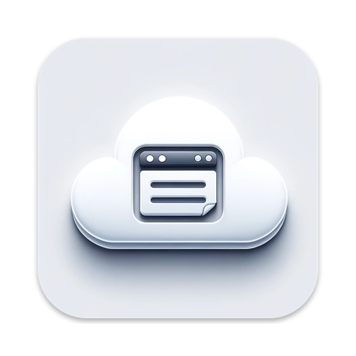
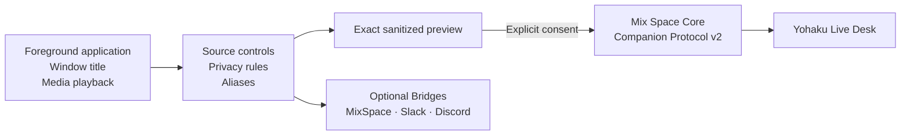

<p align="center">
  
</p>

<h1 align="center">Yohaku Companion</h1>

<p align="center">
  A privacy-first macOS companion that brings your current application and media presence to Yohaku.
</p>

<p align="center">
  <a href="https://github.com/Innei/YohakuCompanion/releases/latest"></a>
  
  
  
  <a href="LICENSE"></a>
</p>

Yohaku Companion is the native desktop companion for [Yohaku](https://github.com/Innei/Yohaku). It pairs a Mac directly with a Companion-enabled Mix Space Core, shows the exact sanitized state that may become public, and starts Live Desk only after explicit consent.

It is the macOS successor to ProcessReporter, with a new product identity and a first-party Yohaku connection. It is not a productivity tracker: it does not calculate work time, rankings, focus scores, or behavioral analytics.

> [!NOTE]
> Live Desk uses Companion Protocol v2 directly. It does not require the legacy Mix Space cloud function. The MixSpace HTTP Bridge remains available only for sites that still use the older Shiro activity endpoint.

## How it works



Live Desk is a short-lived current-state projection, not an activity timeline. Each update replaces the previous snapshot; pause, sleep, screen lock, device removal, and application termination trigger a best-effort clear, while the server lease provides the final expiry boundary.

## What can be shared

| Source | Public projection | Default and privacy boundary |
| --- | --- | --- |
| Application | Sanitized display name and optional activity label | Controlled by the Applications source and per-application Share, Hide, or Alias rules |
| Window title | Current sanitized title | Off by default; read only while Window Titles is enabled and Accessibility permission is granted |
| Media | Title, artist, album, media kind, and sanitized player name | Controlled independently by the Media Playback source and media privacy rules |
| Playback | Playing or paused state, duration, sampled position, rate, and stable session ID | Published only when Core advertises the negotiated `mediaTimeline` capability |

Raw bundle identifiers, executable paths, process IDs, credentials, artwork, screenshots, and keystrokes are never part of the Live Desk payload.

## Privacy model

- Pairing installs a revocable device credential but leaves Live Desk disabled.
- Enabling Live Desk requires reviewing the current sanitized preview and explicitly confirming it.
- A privacy or source change invalidates the previous preview and forces a fresh consent boundary.
- Device Tokens are restricted to protected storage and the HTTP `Authorization` header.
- Live Desk, local Sync History, and optional Bridges receive sanitized domain values rather than raw capture objects.
- Yohaku Companion uses its own bundle identifiers, Application Support directory, database, and credential namespace. It never reads, copies, migrates, or deletes ProcessReporter data.

## Requirements

- Apple Silicon Mac. Intel Macs are not supported.
- macOS 15.0 or later.
- A current Mix Space Core with Companion Live Desk enabled.
- A Yohaku deployment with its Live Desk module enabled.
- Accessibility permission only when window-title sharing is enabled.

The built-in media provider works without additional software. On macOS 15.4 or later, the optional [media-control](https://github.com/ungive/media-control) helper can enrich process and artwork metadata.

## Install and pair

1. Download the current DMG from [GitHub Releases](https://github.com/Innei/YohakuCompanion/releases/latest), then move **Yohaku Companion** to Applications.
2. Enable Live Desk in Core and restart it:

   ```bash
   COMPANION_LIVE_DESK_ENABLED=true
   ```

3. Enable the module in Yohaku theme configuration:

   ```json
   {
     "module": {
       "liveDesk": {
         "enable": true
       }
     }
   }
   ```

4. Open the **Companion** page in Mix Space Admin and generate a one-time pairing code.
5. In Yohaku Companion, open **Settings → Yohaku**, enter the public site URL, a device name, and the pairing code.
6. Review **Current Sanitized Preview**, then explicitly enable Live Desk.

Pairing codes expire after ten minutes and can be used only once.

> [!IMPORTANT]
> Consult the release notes for the artifact's signing status. Until Developer ID credentials are enabled, releases are ad-hoc signed and macOS may require **Open Anyway** on first launch. An update may also require Accessibility permission to be granted again because an ad-hoc identity is not stable across builds.

## Optional Bridges and local audit

The first-party Yohaku connection is independent from optional delivery paths:

| Integration | Role |
| --- | --- |
| MixSpace | Compatibility HTTP Bridge for the legacy activity cloud function |
| Slack | Sanitized profile-status delivery |
| Discord | Local Rich Presence through the Discord client |
| S3-compatible storage | Optional application-icon hosting; it is an asset service, not a Presence destination |

Sync History stores a bounded local audit of sanitized Bridge delivery attempts and normalized results. It does not retain credentials, endpoints, authorization headers, raw provider responses, or raw capture payloads.

## Development

```bash
bash scripts/setup_discord_sdk.sh

xcodebuild \
  -project YohakuCompanion.xcodeproj \
  -scheme YohakuCompanion \
  -configuration Debug \
  -destination 'generic/platform=macOS' \
  CODE_SIGNING_ALLOWED=NO \
  SWIFT_STRICT_CONCURRENCY=complete \
  build
```

The project, target, scheme, Swift module, and source directory all use `YohakuCompanion`. Debug and Release builds have separate bundle identities:

| Build | Bundle identifier | Product |
| --- | --- | --- |
| Debug | `dev.innei.YohakuCompanion.debug` | `YohakuCompanion_DEV.app` |
| Release | `dev.innei.YohakuCompanion` | `YohakuCompanion.app` |

Behavior-oriented protocol, pairing, consent, lifecycle, media-timing, and settings-transaction harnesses are documented in [DEVELOPMENT.md](DEVELOPMENT.md).

## Further reading

- [User guide](USER_GUIDE.md)
- [Architecture](ARCHITECTURE.md)
- [Companion Protocol v2 API](API.md)
- [Product specification](YOHAKU_COMPANION_PRODUCT_SPEC.md)
- [Development and verification](DEVELOPMENT.md)
